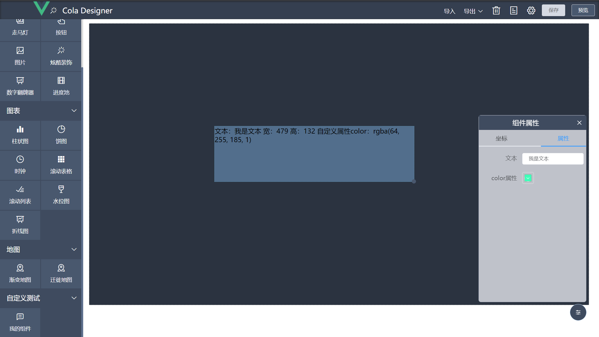
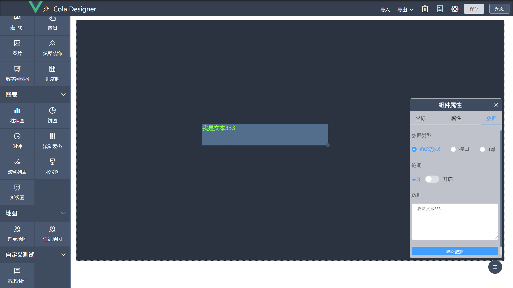

# 示例
## 创建自定义组件
本节将以文本组件为例，从0开始创建自定义组件，需要VUE基础。

1. 在components文件夹新建文件夹 mycpt
2. 在mycpt文件夹新建cpt-test-text.vue，内容如下：
```vue
<template>
  <div>
    文本：{{option.attribute.text}}
    宽：{{width}}
    高：{{height}}
    自定义属性color：{{option.attribute.color}}
  </div>
</template>

<script>
export default {
  name: "cpt-test-text",
  title: '我的组件',
  icon: 'el-icon-chat-line-square',
  initWidth: 300,
  initHeight: 50,
  group:'test',
  props: {
    option: Object,
    width:{type:Number,default:300},
    height:{type:Number,default:200},
  },
}
</script>
```
3. 在mycpt文件夹新建cpt-test-text-option.vue，内容如下：
```vue
<template>
  <div>
    <el-form label-width="100px" size="mini">
      <el-form-item label="文本">
        <el-input v-model="attribute.text" show-alpha/>
      </el-form-item>
      <el-form-item label="color属性">
        <el-color-picker v-model="attribute.color" show-alpha/>
      </el-form-item>
    </el-form>
  </div>
</template>

<script>
export default {
  name: "cpt-test-text-option",
  props: { attribute: Object },
}
</script>
```
4. 打开options.js，在cptOptions中新增如下内容：
```javascript
const cptOptions = {
    test: {//分组标识，对应cpt-test-text.vue中的group
        name: '自定义测试',//分组名称
        icon: '',
        opened: true,//默认展开
        options: {
            'cpt-test-text-option': {
                attribute:{
                    text: '我是文本',
                    color: '#409eff',
                }
            }
        }
    }
}
```
完成上述步骤算是基本创建组件了，可以在设计界面看一下效果：

可见拉伸组件或修改属性组件内容会跟随改变。此时便可以在组件内对这些可变参数进行操作，
可将cpt-test-text.vue修改成如下内容：
```vue
<template>
  <div :style="{width: width+'px', height: height+'px', color: option.attribute.color}">
    {{option.attribute.text}}
  </div>
</template>

<script>
export default {
  name: "cpt-test-text",
  title: '我的组件',
  icon: 'el-icon-chat-line-square',
  initWidth: 300,
  initHeight: 50,
  group:'test',
  props: {
    option: Object,
    width:{type:Number,default:300},
    height:{type:Number,default:200},
  },
}
</script>
```
效果如下：

宽高可设置为100%，这里只是演示可以这样干，部分第三方组件有设置100%的宽高视图不刷新现象，可如图设置宽高。
## 设置动态数据
1. 在option.js中cpt-test-text-option的配置修改成如下内容：
```javascript
const cptOptions = {
    test: {//分组标识，对应cpt-test-text.vue中的group
        name: '自定义测试',//分组名称
        icon: '',
        opened: true,//默认展开
        options: {
            'cpt-test-text-option': {
                cptDataForm: {
                    dataSource: 1,
                    dataText:'我是文本',
                    poolTime: 0
                },
                attribute:{
                    color: '#409eff',
                }
            }
        }
    }
}

```
2. 将cpt-test-text.vue修改成以下内容
```vue
<template>
  <div :style="{width: width+'px', height: height+'px', color: option.attribute.color}">
    {{cptData}}
  </div>
</template>

<script>
import {getDataStr, pollingRefresh} from "@/utils/refreshCptData";

export default {
  name: "cpt-test-text",
  title: '我的组件',
  icon: 'el-icon-chat-line-square',
  initWidth: 300,
  initHeight: 50,
  group:'test',
  props: {
    option: Object,
    width: Number,
    height: Number,
  },
  data(){
    return {
      cptData:'',
      uuid:null
    }
  },
  created() {
    this.uuid = require('uuid').v1();
    this.refreshCptData();
  },
  methods: {
    refreshCptData() {
      pollingRefresh(this.uuid, this.option.cptDataForm, this.loadData)//固定写法
    },
    loadData() {//设置数据
      getDataStr(this.option.cptDataForm).then(res => {
        //res为数据表单的静态数据或执行API返回的数据
        this.cptData = res;
      });
    }
  }
}
</script>

```
3. 将cpt-test-text-option.vue修改成以下内容：
```vue
<template>
  <div>
    <el-form label-width="100px" size="mini">
      <el-form-item label="color属性">
        <el-color-picker v-model="attribute.color" show-alpha/>
      </el-form-item>
    </el-form>
  </div>
</template>

<script>
export default {
  name: "cpt-test-text-option",
  props: { attribute: Object },
}
</script>

```
至此完成自定义组件动态数据的配置。可在数据一栏设置，效果如下：


## 注意事项
* 组件命名避免与已有组件名称相同如:input、el-input... 建议使用个人/公司名称简称-分组名-组件名。
* 组件自定义属性表单命名为：组件名-option。
* 需要配置动态数据的组件必须设置uuid，否则不能清除数据表单轮询定时任务。
* 对视图不刷新的第三方组件可对option.attribute进行深度监听，可参考进度池和地图组件写法。
