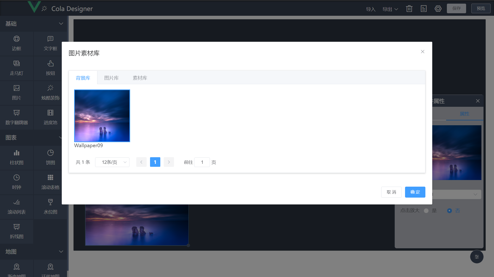

# 配置项·图库组件

## 概览
图库展示后台资源库管理中的内容，对需要使用到图片的自定义组件可在配置表单引入图库组件进行图片选择。



## 使用方式
```vue
<template>
  <div>
    <el-form label-width="80px" size="mini">
      <el-form-item label="图库选择">
        <el-image v-if="attribute.url" @click="showGallery" style="width: 168px; height: 160px"
                  :src="attribute.url" fit="fill"/>
        <div v-else @click="showGallery" class="formItemUpload">
          <i class="el-icon-plus"></i>
        </div>
      </el-form-item>
    </el-form>
    <gallery ref="gallery" @confirmCheck="confirmCheck"/>
  </div>
</template>

<script>
import Gallery from "@/components/gallery";
export default {
  name: "cpt-imagex-option",
  components: {Gallery},
  props: {attribute: Object},
  methods:{
    showGallery(){
      this.$refs.gallery.opened();//弹出图库
    },
    confirmCheck(fileUrl){
      this.attribute.url = fileUrl;//回显
    }
  }
}
</script>

<style scoped>
.formItemUpload{width: 120px; height: 120px;background-color: #fff;border-radius: 6px;text-align: center;line-height: 120px;font-size: 40px;color: #aaa}
</style>

```
