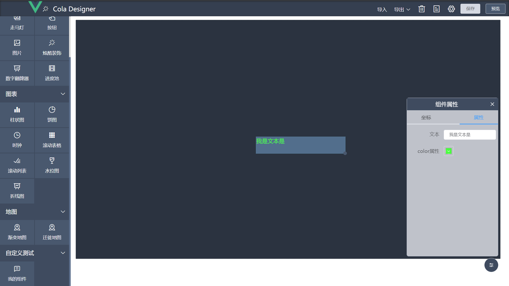

# 自定义组件
本节如何开发自定义组件。

再看一下前端项目结构  


* options.js 中保存所有组件的默认配置项，如文本组件的文字颜色、字体大小等等。
* registerCpt.js 为组件注册器，在此将自定义组件放置在cptList完成注册。
* registerOption.js 为组件配置表单注册器，在此将自定义组件的配置表单放置在cptOptionsList完成注册。

自定义组件创建流程：
```text
在components创建文件夹--->创建组件--->创建组件配置表单--->在options.js设置组件默认配置项  
    --->在registerCpt.js中注册组件--->在registerOption.js注册配置表单--->使用
```

## options.js
cptOptions：

| 属性名      | 说明          | 类型    |是否必填 
|  ----      |  ----        | ----   | ---- 
| name       | 组件分组名称   | String | 是  
| icon       | 组件分组图标   | String | 是
| opened     | 分组是否展开   | String | 是
| children   | 组件配置   | [ Child ] | 是
Child:

| 属性名      | 说明          | 类型    |是否必填| 默认值|
|  ----      |  ----        | ----   | ----| ----  |
| name       | 组件名称   | String | 是  | 无 |
| icon       | 组件图标(/src/assets/icon目录下svg文件名)   | String | 否| 无 |
| cptKey     | 组件唯一标识   | String | 是| 无 |
| width   | 默认宽度   | Number | 否| 400 |
| height   | 默认高度   | Number | 否| 300 |
| cptOptionKey   | 组件配置唯一标识   | String | 否| cptKey+'-option' |
| option   | 组件配置   | Option | 是| 无 |
Option:

| 属性名      | 说明          | 类型    |是否必填| 默认值|
|  ----      |  ----        | ----   | ----| ----  |
| attribute       | 组件属性   | Object | 是  | 无 |
| cptDataForm       | 动态数据配置   | CptDataForm | 否| 无 |


CptDataForm：

| 属性名      | 说明          | 类型    |
|  ----      |  ----        | ----   |
| dataText     | 静态数据/API接口地址/SQL| String |
| dataSource     | 数据源，1:静态数据、2:API接口、3:SQL| Number |
| pollTime     | 接口轮询时间| Number |

自定义组件若未在option.js中声明cptDataForm，则配置栏不会出现数据配置表单。


## 组件props

| 属性名      | 说明          | 类型    |
   |  ----      |  ----        | ----   |
| option     | 自定义组件的属性和数据源| Object |
| height     | 组件高度| Number |
| width      | 组件宽度| Number |


## 组件配置表单props
| 属性名      | 说明          | 类型    |
|  ----      |  ----        | ----   |
| attribute     | 自定义组件的自定义属性| Object |


# 示例-创建自定义组件
## 示例
1. 在components文件夹新建文件夹 mycpt
2. 在mycpt文件夹新建cpt-test-text.vue，内容如下：
```vue
<template>
  <div>
    文本：{{option.attribute.text}}
    宽：{{width}}
    高：{{height}}
    自定义属性color：{{option.attribute.color}}
  </div>
</template>

<script>
export default {
  name: "cpt-test-text",
  props: {
    option: Object,
    width: Number,
    height: Number,
  },
}
</script>
```
3. 在/components/registerCpt.js中的cptList注册这个组件。
4. 在mycpt文件夹新建cpt-test-text-option.vue，内容如下：
```vue
<template>
  <div>
    <el-form label-width="100px" size="mini">
      <el-form-item label="文本">
        <el-input v-model="attribute.text" show-alpha/>
      </el-form-item>
      <el-form-item label="color属性">
        <el-color-picker v-model="attribute.color" show-alpha/>
      </el-form-item>
    </el-form>
  </div>
</template>

<script>
export default {
  name: "cpt-test-text-option",
  props: { attribute: Object },
}
</script>
```
5. 在/components/registerOption.js中的cptOptionsList注册cpt-test-text-option这个组件。
6. 打开options.js，在export default中新增输出组件的配置项：
```javascript
export default [
    ...
    {
        name: '自定义测试',//分组名称
        icon: '',//分组图标，对应/src/assets/icon/文件夹下的图片名
        opened: true,//默认展开
        children:[
            {
                name: '边框', 
                icon: 'border', //分组图标，对应/src/assets/icon/components/文件夹下的图片名
                cptKey: 'cpt-test-text',//组件名\组件唯一标识
                cptOptionKey:'cpt-test-text-option',//组件配置表单名，不写默认为:组件名-option
                option: {
                    attribute:{//配置项
                        text: '我是文本',
                        color: '#409eff',
                    }
                }
            }
        ]
        
    }
]
```
完成上述步骤算是基本创建组件了，可以在设计界面看一下效果：

可见拉伸组件或修改属性组件内容会跟随改变。此时便可以在组件内对这些可变参数进行操作，
可将cpt-test-text.vue修改成如下内容：
```vue
<template>
  <div :style="{width: width+'px', height: height+'px', color: option.attribute.color}">
    {{option.attribute.text}}
  </div>
</template>

<script>
export default {
  name: "cpt-test-text",
  props: {
    option: Object,
    width:Number,
    height:Number,
  },
}
</script>
```
效果如下：

宽高可设置为100%，这里只是演示可以这样干，部分第三方组件有设置100%的宽高视图不刷新现象，可如图设置宽高。
## 设置动态数据
1. 在option.js中cpt-test-text的配置修改成如下内容：
```javascript
export default [
    ...
        {
            name: '自定义测试',//分组名称
            icon: '',//分组图标，对应/src/assets/icon/文件夹下的图片名
            opened: true,//默认展开
            children:[
                {
                    name: '我的文本组件',
                    icon: '', //分组图标，对应/src/assets/icon/components/文件夹下的图片名
                    cptKey: 'cpt-test-text',//组件名\组件唯一标识
                    cptOptionKey:'cpt-test-text-option',//组件配置表单名，不写默认为:组件名-option
                    option: {
                        attribute:{//配置项
                            text: '我是文本',
                            color: '#409eff',
                        },
                        cptDataForm:{//动态数据配置
                            dataSource: 1, //默认数据源1:静态数据，2:api接口,3:SQL
                            pollTime: 0,//轮询时间
                            dataText: '{"value": "文本组件动态数据"}',//静态数据
                            apiUrl:'/test',//api地址
                            sql:'select xxx'//sql
                        },
                    }
                }
            ]

        }
]

```
2. 将cpt-test-text.vue修改成以下内容
```vue
<template>
  <div :style="{width: width+'px', height: height+'px', color: option.attribute.color}">
    {{cptData.value}}
  </div>
</template>

<script>
import {getDataJson, pollingRefresh} from "@/utils/refreshCptData";

export default {
  name: "cpt-test-text",
  props: {
    option: Object,
    width: Number,
    height: Number,
  },
  data(){
    return {
      cptData:'',
      uuid:null
    }
  },
  created() {
    this.uuid = require('uuid').v1();
    this.refreshCptData();
  },
  methods: {
    refreshCptData() {
      pollingRefresh(this.uuid, this.option.cptDataForm, this.loadData)//固定写法
    },
    loadData() {//设置数据
      getDataJson(this.option.cptDataForm).then(res => {
        //res为数据表单的静态数据或执行API返回的数据
        this.cptData = res;
      });
    }
  }
}
</script>

```
3. 将cpt-test-text-option.vue修改成以下内容：

```vue
<template>
  <div>
    <el-form label-width="100px" size="mini">
      <el-form-item label="color属性">
        <el-color-picker v-model="attribute.color" show-alpha/>
      </el-form-item>
    </el-form>
  </div>
</template>

<script>
export default {
  name: "cpt-test-text-option",
  props: { attribute: Object },
}
</script>

```
至此完成自定义组件动态数据的配置。可在数据一栏设置，效果如下：



## 注意事项
* 组件命名避免与已有组件名称相同如:input、el-input... 建议使用个人/公司名称简称-分组名-组件名。
* 需要配置动态数据的组件必须设置uuid，否则不能清除数据表单轮询定时任务。
* 对视图不刷新的第三方组件可对option.attribute进行深度监听，可参考进度池和地图组件写法。
