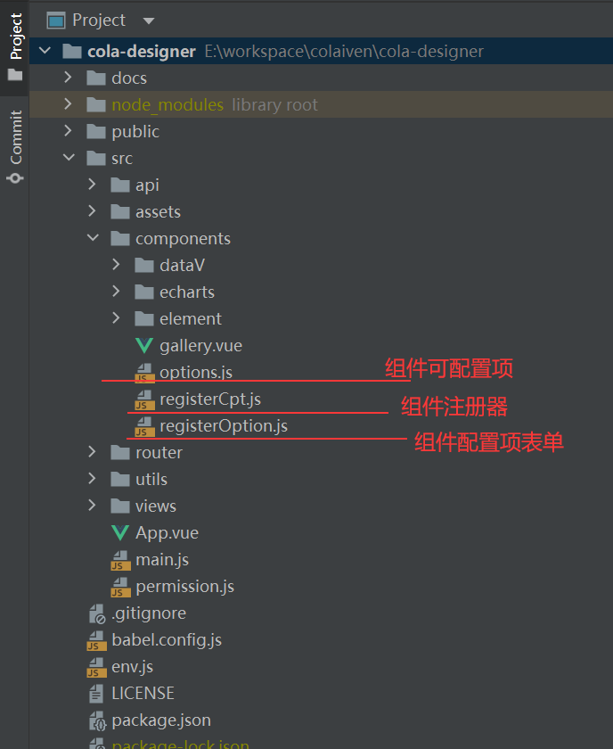

# 自定义组件
本节将介绍如何开发自定义组件，需要VUE基础。


再看一下前端项目结构  



* options.js 中保存所有组件的默认配置项，如文本组件的文字颜色、字体大小等等。
* registerCpt.js 为组件注册器，在此将自定义组件放置在cptList完成注册。
* registerOption.js 为组件配置表单注册器，在此将自定义组件的配置表单放置在cptOptionsList完成注册。

自定义组件创建流程：
```text
在components创建文件夹--->创建组件--->创建组件配置表单--->在options.js设置组件默认配置项  
    --->在registerCpt.js中注册组件--->在registerOption.js注册配置表单--->使用
```

在创建组件后需在export default 输出以下属性：

| 属性名      | 说明          | 类型    |是否必填  | 默认值|
   |  ----      |  ----        | ----   | ----   | ----  |
| name       | 组件唯一标识   | String | 是      | 无 |
| title      | 组件名        | String  | 是    | 未命名组件 |
| icon       | 组件图标      | String  | 是     | el-icon-question |
| initWidth  | 组件宽度(px)   | Number  | 否     | 300 |
| initHeight | 组件高度(px)   | Number  | 否     | 200 |
| group      | 组件分组标识   | String  | 否     | default |

组件props（以下属性可直接在组建中使用，值与页面同步）：

| 属性名      | 说明          | 类型    |
   |  ----      |  ----        | ----   |
| option     | 自定义组件的属性和数据源| Object |
| height     | 组件高度| Number |
| width      | 组件宽度| Number |


组件配置表单props（以下属性可直接在表单中绑定，值与页面同步）：
| 属性名      | 说明          | 类型    |
|  ----      |  ----        | ----   |
| attribute     | 自定义组件的自定义属性| Object |

示例：
```vue
<template>
  <div>
    文本：{{option.text}}
    宽：{{option.width}}
    高：{{option.height}}
  </div>
</template>

<script>
export default {
    name: "cpt-text",
    title: '文字框',
    icon: 'el-icon-chat-line-square',
    initWidth: 300,
    initHeight: 50,
    group:'element',
    props: {
        option: Object,
        width:{type:Number,default:300},
        height:{type:Number,default:200},
    },
}
</script>
```

## 动态数据
自定义组件若未在option.js中声明cptDataForm，则配置栏不会出现数据配置表单，cptDataForm中配置项如下：

| 属性名      | 说明          | 类型    |
|  ----      |  ----        | ----   |
| dataText     | 静态数据/API接口地址/SQL| String |
| dataSource     | 数据源，1:静态数据、2:API接口、3:SQL| Number |
| pollTime     | 自定义组件的自定义属性| Number |
