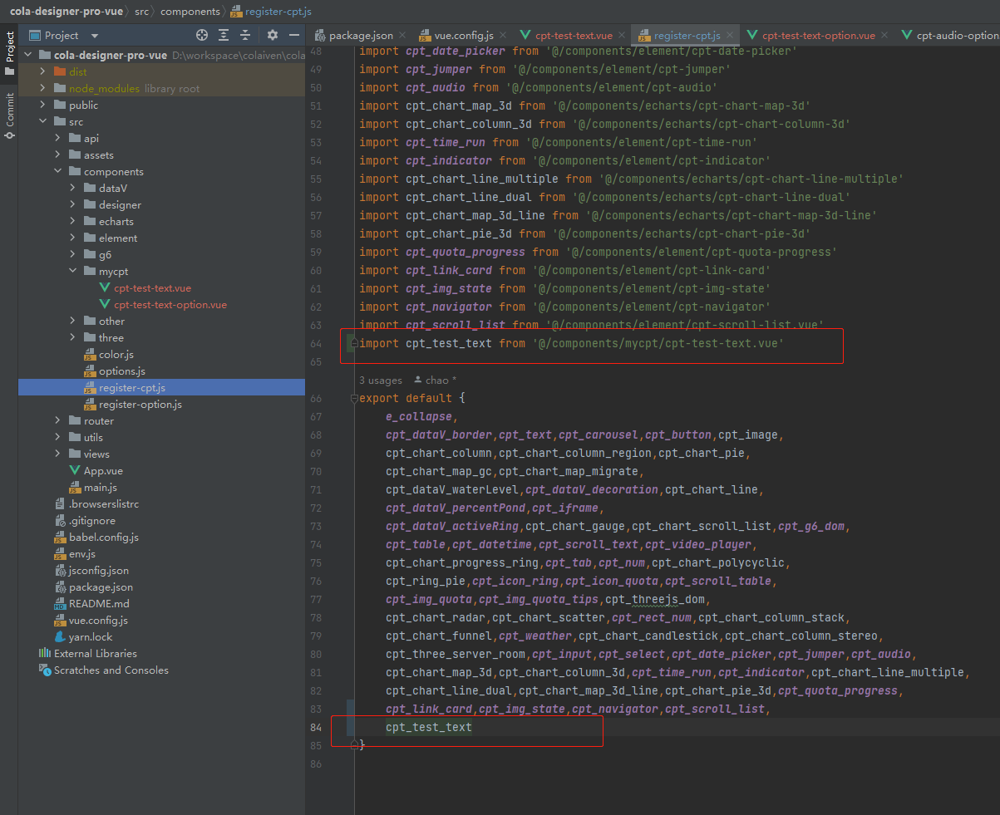
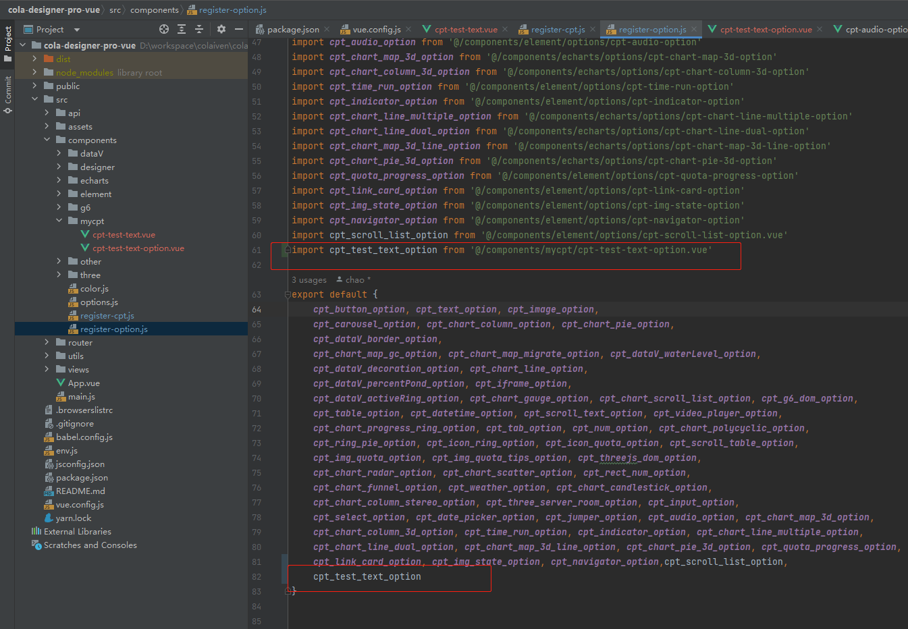
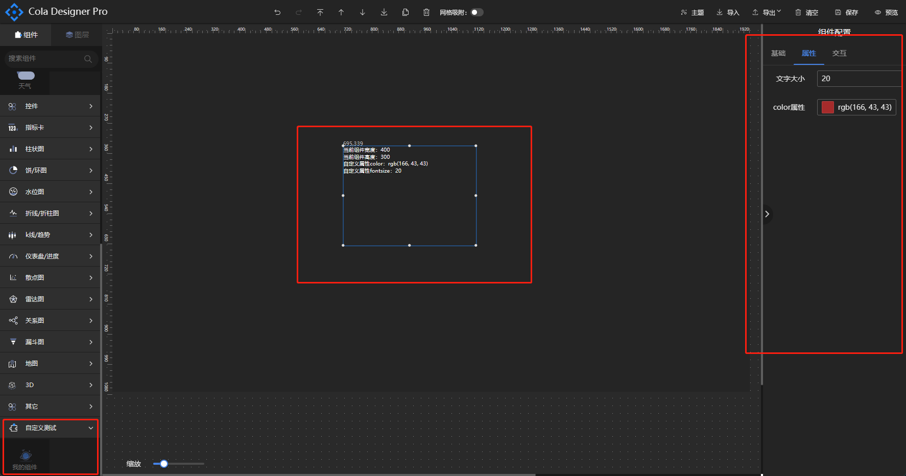
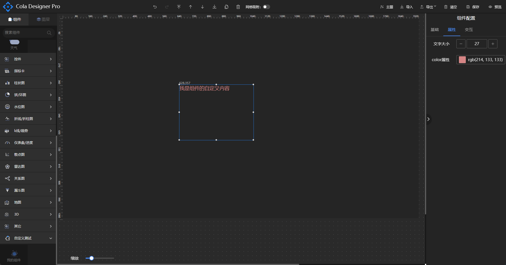
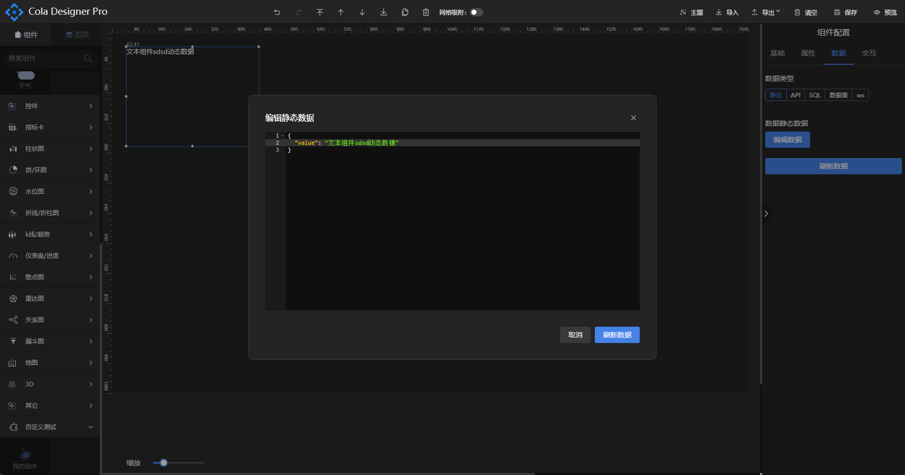

# 教程

## 新建组件
1. 在components文件夹新建文件夹 mycpt
2. 在mycpt文件夹新建cpt-test-text.vue，内容如下：
```vue
<template>
  <div style="color: #fff">
    当前组件宽度：{{width}}<br>
    当前组件高度：{{height}}<br>
    自定义属性color：{{option.attribute.color}}<br>
    自定义属性fontsize：{{option.attribute.fontSize}}
  </div>
</template>

<script setup>
const props = defineProps({
  width:Number,
  height:Number,
  option:Object,
  show:Boolean
})
</script>
```
3. 在/components/registerCpt.js中的export这个组件。



4. 在mycpt文件夹新建cpt-test-text-option.vue，内容如下：
```vue
<template>
  <t-form label-width="100px">
    <t-form-item label="文字大小">
      <t-input-number v-model="attribute.fontSize"/>
    </t-form-item>
    <t-form-item label="color属性">
      <t-color-picker v-model="attribute.color"/>
    </t-form-item>
  </t-form>
</template>

<script setup>
const props = defineProps({
  attribute:Object
})
</script>
```
5. 在/components/registerOption.js中export这个组件。



6. 打开options.js，在export default中新增输出组件的[配置项](options.md)：
```javascript
export default [
    ...
        {
            name: '自定义测试',//分组名称
            icon: 'basic',//分组图标，对应/src/assets/icon/文件夹下的图片名
            opened: true,//默认展开
            children:[
                {
                    name: '我的组件', //组件名称
                    icon: 'default', //分组图标，对应/src/assets/icon/components/文件夹下的svg图片名
                    cptKey: 'cpt-test-text',//组件名\组件唯一标识
                    cptOptionKey:'cpt-test-text-option',//组件配置表单名，不写默认为:组件名-option
                    option: {
                        attribute:{//配置项
                            fontSize: 20,
                            color: '#fff',
                        }
                    }
                }
            ]
        }
]
```
完成上述步骤算是基本创建组件了，可以在设计界面看一下效果：



可见拉伸组件或修改属性组件内容会跟随改变。此时便可以在组件内对这些可变参数进行操作，
可将cpt-test-text.vue修改成如下内容：
```vue
<template>
  <div :style="{width: width+'px', height: height+'px', color: option.attribute.color, fontSize:option.attribute.fontSize+'px'}">
    我是组件的自定义内容
  </div>
</template>

<script setup>
const props = defineProps({
  width:Number,
  height:Number,
  option:Object,
  show:Boolean
})
</script>
```
效果如下：



宽高可设置为100%，这里只是演示可以这样干，部分第三方组件有设置100%的宽高视图不刷新现象，可如图设置宽高。此时一个静态组件就新增完成了，可以根据实际需要自行实现组件功能，完善组件的配置项。如果需要对内置组件属性新增或者调整，找到需要修改的组件的相应文件修改即可。

## 设置动态数据
1. 在option.js中cpt-test-text的配置修改成如下内容：
```javascript
export default [
    ...
        {
            name: '自定义测试',//分组名称
            icon: 'basic',//分组图标，对应/src/assets/icon/文件夹下的图片名
            opened: true,//默认展开
            children:[
                {
                    name: '我的组件', //组件名称
                    icon: 'default', //分组图标，对应/src/assets/icon/components/文件夹下的svg图片名
                    cptKey: 'cpt-test-text',//组件名\组件唯一标识
                    cptOptionKey:'cpt-test-text-option',//组件配置表单名，不写默认为:组件名-option
                    option: {
                        attribute:{//配置项
                            fontSize: 20,
                            color: '#fff',
                        },
                        cptDataForm:{//动态数据配置
                            dataSource: 1, //默认数据源1:静态数据，2:api接口,3:SQL,4:数据集,5:websocket
                            pollTime: 0,//默认轮询时间
                            dataText: '{"value": "文本组件动态数据"}',//静态数据，必须为JSON格式
                            apiUrl:'/test',//默认api地址
                            sql:'select xxx'//默认sql
                        }
                    }
                }
            ]
        }
]

```
2. 将cpt-test-text.vue修改成以下内容
```vue
<template>
  <div :style="{width: width+'px', height: height+'px', color: option.attribute.color, fontSize:option.attribute.fontSize+'px'}">
    {{cptData.text}}
  </div>
</template>

<script setup>
import {getDataJson, pollingRefresh} from "@/utils/refresh-cpt-data";
import {reactive} from "vue";
const props = defineProps({
  width:Number,
  height:Number,
  option:Object,
  show:Boolean
})

//uuid 必须
let uuid = require('uuid').v1();
//自定义组件值接收字段
let cptData = reactive({text:''});

//refreshCptData固定写法，必须！
const refreshCptData = () => {
  pollingRefresh(uuid, props.option.cptDataForm, loadData)
}

//自定义数据处理方法
const loadData = () => {
  getDataJson(props.option.cptDataForm).then(res => {
    //res为数据表单的静态数据或执行API返回的数据
    cptData.text = res.value;
  });
}

//初始化数据，可选。echarts类组件需要放在onMounted中执行！
refreshCptData()
//暴露refreshCptData，必须！
defineExpose({refreshCptData})
</script>

```

至此完成自定义组件动态数据的配置，刷新页面从新从左边拖拽组件生效，可在数据一栏设置动态数据或者修改静态数据，效果如下：



## 注意事项
* 组件命名避免与已有组件名称相同如:input、el-input... 建议使用个人/公司名称简称-分组名-组件名。
* 需要配置动态数据的组件必须设置uuid，否则不能清除数据表单轮询定时任务。
* 对视图不刷新的第三方组件可对option.attribute进行深度监听，可参考进度池和地图组件写法。