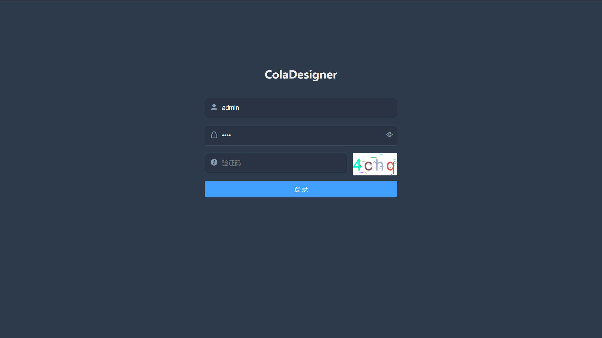
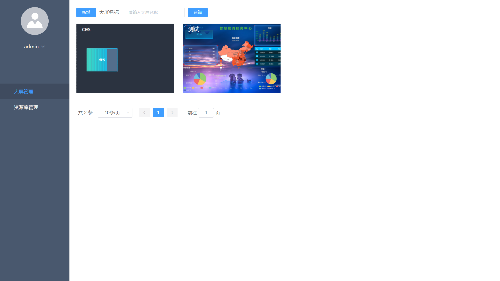
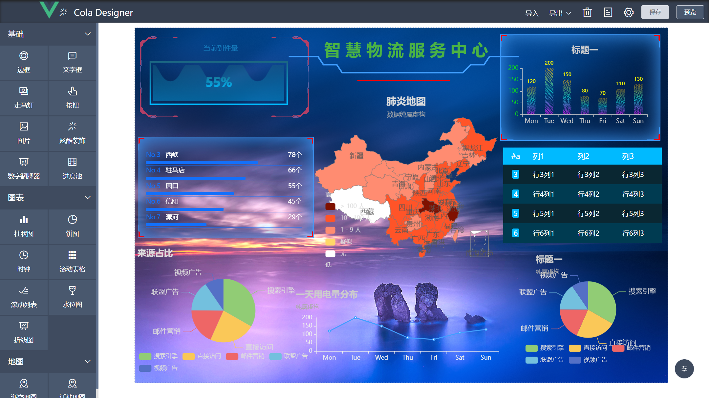
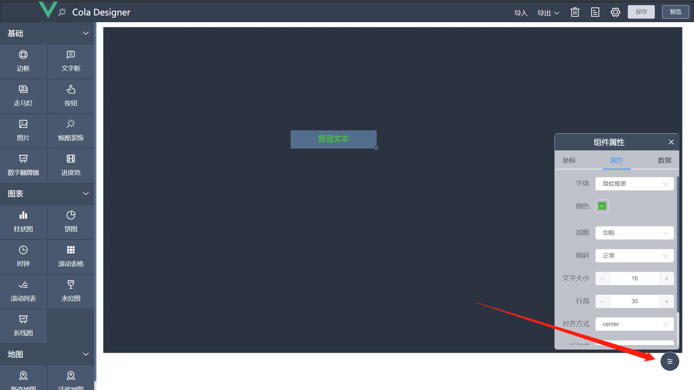
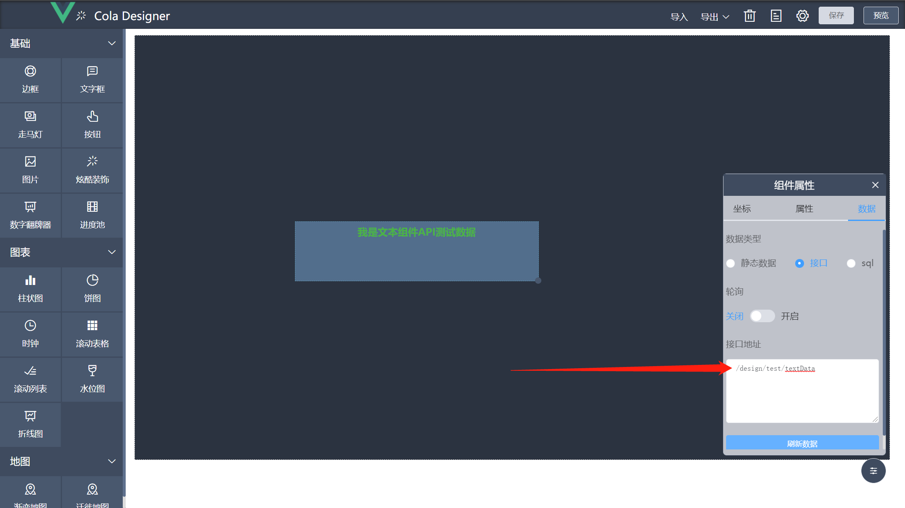
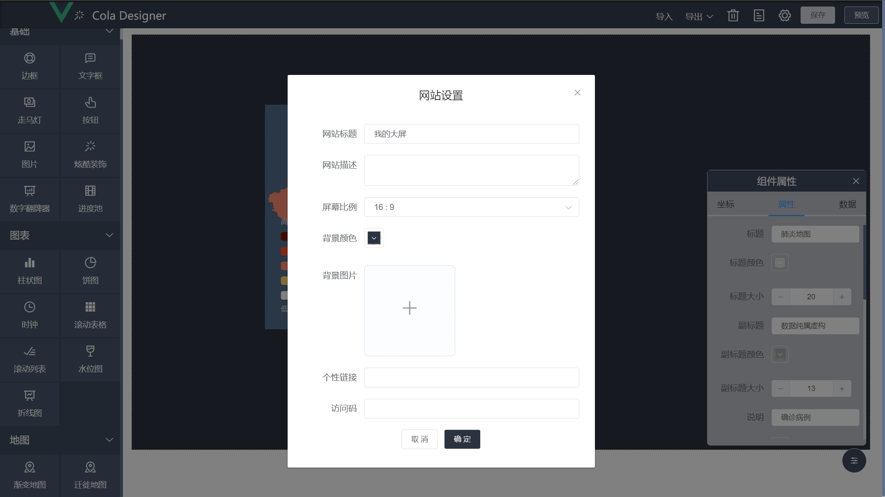
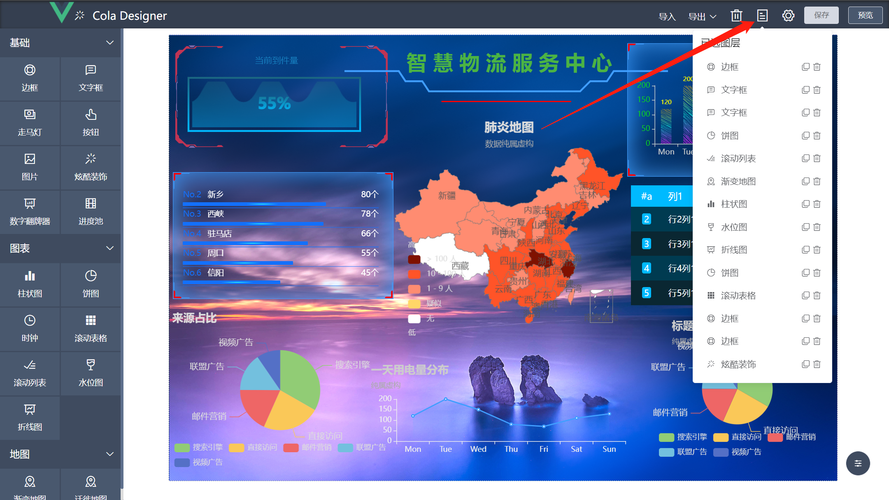
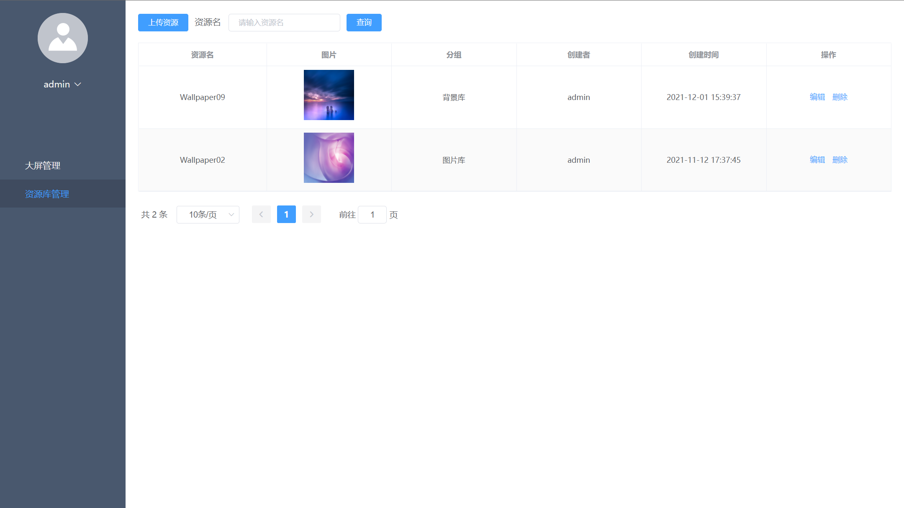

# 使用说明

## 登录
项目启动成功后访问前端页面会跳转至的登录页面，请使用以下账户登录：
```text
用户名：admin
密码：0000
```


## 大屏管理
点击登录按钮进入大屏列表（大屏列表如下图所示），大屏列表展示由当前用户创建的所有大屏，将鼠标放置在大屏上会出现操作条，
依次为：设计、访问、分享、删除。点击按钮可继续相应的操作。



## 设计
在大屏列表页面点击设计按钮，则跳转至所点击大屏的设计界面，如下图所示。

在设计界面，左侧栏为组件栏，使用方式为：选择需要使用的组件，长按鼠标左键将组件拖动至中间深色的设计区域，
放下组件后会在右下角弹出此组件的可配置项表单，如文本组件的字体颜色、大小等等，修改配置项设计区域的组件会发生相应的变化，
部分组件未深度监听可使用数据一栏中的刷新按钮进行同步。  
将鼠标放置在设计界面的组件上，组件右上角会出现两个按钮，分别为复制和删除，点击按钮可执行相应的操作。

## 配置栏
配置栏展示的是当前选中组件的可配置项表单，在设计界面的右下方，在拖动放下组件后自动弹出，可点击配置栏右上角的“X”按钮进行影藏，
再次展示需要点击右下角的配置按钮。


## 动态数据
组件拖放后默认展示为静态数据，可在右下角配置栏数据一栏中修改，暂时提供了静态数据、API接口、SQL进行数据渲染，
在使用API接口时，需加上vue.config.js中代理的前缀，如下图所示

vue.config.js:
```javascript
module.exports = {
    publicPath: './',
    outputDir: "docs",
    devServer: {
        disableHostCheck: true,
        port: 8009,
        open: true,
        overlay: {
            warnings: false,
            errors: true
        },
        proxy: {
            '/design': {
                target: 'http://127.0.0.1:6882',
                ws: false,
                changeOrigin: true,
                pathRewrite: {
                    '/design': ''
                }
            },
            '/fileUrl': {
                target: 'http://127.0.0.1:6882',
                ws: false,
                changeOrigin: true,
                pathRewrite: {
                    '/fileUrl': ''
                }
            },
        }
    },
}
```
可以看到/design代理到了localhost:6882地址，可自行配置代理以访问其他后端项目的接口。  
在使用SQL进行渲染时，需在文本框输入对应的SQL，点击刷新按钮会向后端发起API请求，接口地址为/sql/executeSelect，
对应后端项目的 SqlExecuteController中的接口，可在此接口中自行更改数据源。    
* 注意：API接口和SQL返回的数据格式必须和静态数据文本的格式一致，否则不能渲染成功。
* 抽取fileUrl为方便分离资源服务器，没有分离需求可与大屏代理一致

## 设置
大屏基本信息设置项在设计界面的右上方设计按钮，可设置大屏名称、背景图片、访问码等信息，点击保存按钮会同步到数据库。



## 导入&导出
导入导出功能在设计界面的右上方操作条中的相应按钮，可导出为图片和设计文件，
导出的设计文件为.cd后缀，其实是一个JSON文件，内容则是大屏的基本信息和大屏上组件的位置坐标和可配置数据。
导入暂只支持.cd文件的导入，版本不一致导入不成功。


## 已选列表
需要查看当前大屏添加的所有组件可点击右上角列表按钮，点击单列项组件会高亮，可执行组件的复制和删除操作



## 预览&保存
点击右上角预览按钮会讲当前设计保存到浏览器localstorge，预览页面取localstorge中的数据进行渲染。
点击右上角保存按钮会讲当前设计保存到数据库。


## 资源库管理
资源库管理对设计器可能会使用到的图片资源进行管理，对应设计器图片组件的选择图片功能，设计人员可一次性将设计的切图上传至资源库，
使用时可直接选择，避免图片的重复上传。在上传资源时，需要选择资源对应的分组，目前系统默认了背景库、图片库、素材库三个分组，
对应数据库design_img_group表中的数据，可自行对其进行增删操作（有兴趣的小伙伴也可自行实现分组管理页面）。


