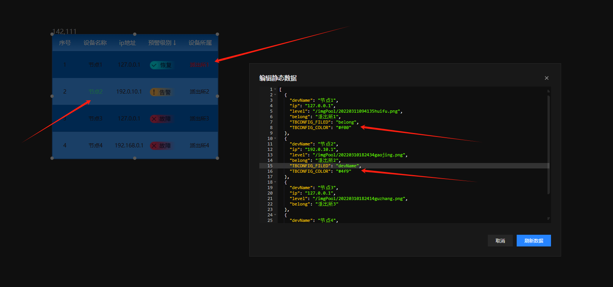
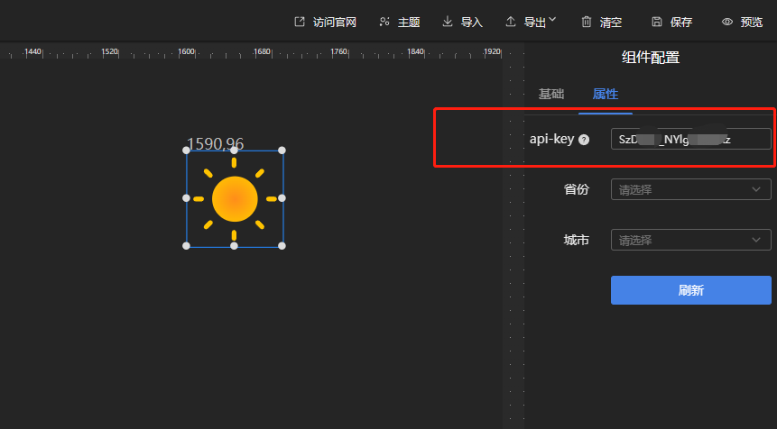

# 组件

## 边框
## 按钮
## 文本

* 配置属性：


| 属性 | 作用                  | 类型     |
|----|---------------------|--------|
| 字体 | 修改文字字体              | select |
| 行高 | 修改文字在容器中的行高，为0时则垂直居中 | 数值     |

* 数据格式：


| 字段      | 说明      | 类型 |
|---------|---------|----|
| value   | 显示的文本内容 | 字符 |

## 滚动文字
## 图片
## 轮播图
## 装饰
## iframe

iframe组件要求目标页面开启允许iframe嵌入，否则无法显示！

## 静态表格
## 滚动表格

已知bug：在<2.3.2版本中，设计时调整了表格列宽后需要重新拉伸一下表格组件宽度，否则列数据会重叠，预览时不存在此问题。

高级操作：可在数据中可通过关键字控制指定行列字段字体颜色：


| 关键字   | 说明            | 类型 |
|-------|---------------|----|
| TBCONFIG_FILED | 需要指定的列字段      | 字符 |
| TBCONFIG_COLOR | 需要指定的列字段的字体颜色 | 字符 |

示例：控制第一行和第二行某一字段的颜色


## 当前时间
## 视频
## 音频
## 天气

天气组件可显示当前城市或指定城市天气图标，默认数据来源由 [心知天气](https://www.seniverse.com/) 提供，交付的软件使用个人注册的免费版，私有化部署时请购买官方套餐并更换API-KEY。



配置栏API-KEY未填写时，则使用后台jar包内置的APIKEY(此为免费版，api请求额度有限)，可以在后端application-prod.yml配置中添加以下内容并重启jar包。若前端配置栏填写了API-KEY则优先使用。

```yaml
seniverse: 
  key: '您的key'
```

省份和城市默认未选择，未选择时使用IP进行定位。鼠标放置在天气图片上时会显示具体的省份和城市。

ps:

心知天气API文档：[https://seniverse.yuque.com/hyper_data/api_v3/nyiu3t](https://seniverse.yuque.com/hyper_data/api_v3/nyiu3t)

心知天气价格：[https://seniverse.yuque.com/hyper_data/api_v3/nyiu3t](https://seniverse.yuque.com/hyper_data/api_v3/nyiu3t)


## 选项卡
## 输入框
## 下拉框
## 日期选择
## 跳转
## 导航器
## 数值文本
## 统计指标
## 数字翻牌器
## 计时器
## 增长指标
## 进度指标
## 链接卡片
## 柱状图
## 堆积柱状图
## 区间柱状图
## 排行榜
## 3D柱状图
## 基础饼图
## 玫瑰图
## 环形饼图
## 同心环图
## 动态环形图
## 聚环图
## 3D饼图
## 水位图
## 折线图
## 面积图
## 折线柱状图
## 双Y轴折线柱状图

数据格式：

| 字段    | 说明                         | 类型     |
|-------|----------------------------|--------|
| group | 分组标识                       | String |
| y     | 数据对应哪个y轴，可选"L"和"R"         | String |
| unit  | 数值单位，可为空                   | String |
| type  | 渲染类型，可选"line"(折线)和"bar"(柱) | String |
| data  | 渲染的数据                      | Data   |

Data:

| 字段    | 说明          | 类型     |
|-------|-------------|--------|
| name  | 数据名称，对应X轴显示 | String |
| value | 数值，对应Y轴显示   | Number |

## 多Y轴折线柱状图
## 堆叠矩阵图
## k线图
## 仪表盘
## 渐变仪表盘
## 进度池
## 环形进度
## 散点图
## 气泡图
## 雷达图
## 关系图
## 漏斗图
## 渐变地图
## 飞线地图

数据格式：

| 字段 | 说明      | 类型              |
|----|---------|-----------------|
|  lines  | 飞线数据    | Array[Line]     |
|  bars  | 地图覆盖物数据 | Array[Bar]      |
|  mapData  | 地图色块数据  | Array[MapDatas] |

Line:

| 字段 | 说明                         | 类型            |
|----|----------------------------|---------------|
|  start  | 起点经纬度，经度在前，维度在后            | Array[Number] |
|  end  | 终点经纬度，经度在前，维度在后           | Array[Number] |

Bar:

| 字段   | 说明               | 类型            |
|------|------------------|---------------|
| name | 覆盖物名称            | String        |
| lct  | 地点经纬度，经度在前，维度在后  | Array[Number] |
| value  | 覆盖物数值，鼠标移上覆盖物时显示 | Number        |

MapData:

| 字段   | 说明                     | 类型         |
|------|------------------------|------------|
| name | 区域名称，对应地图上显示的，如如广东、成都市        | String     |
| value  | 区域数值，数值不同，区域颜色不同(参考配置) | Number     |

## 3D地图
## 3D飞线地图
## 模型
## 机房场景
## 告警图
## 线路状态
## 状态图
