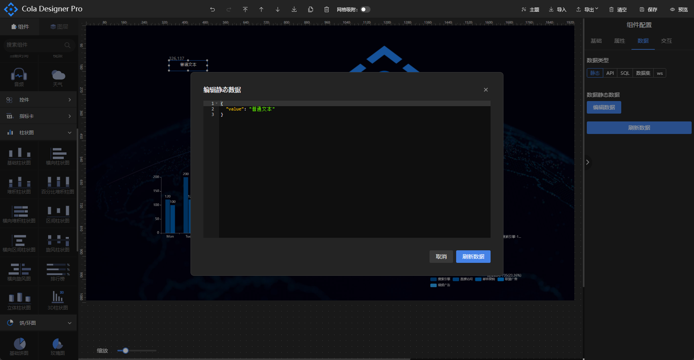
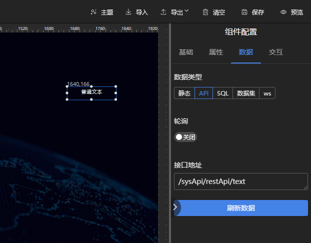
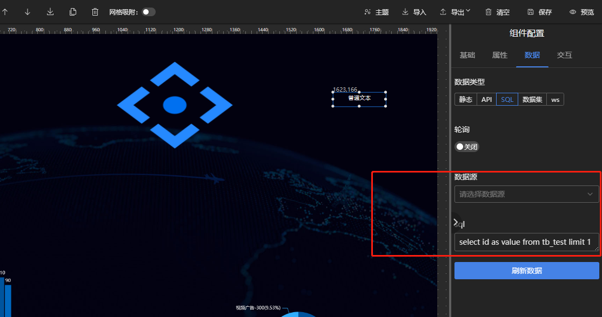
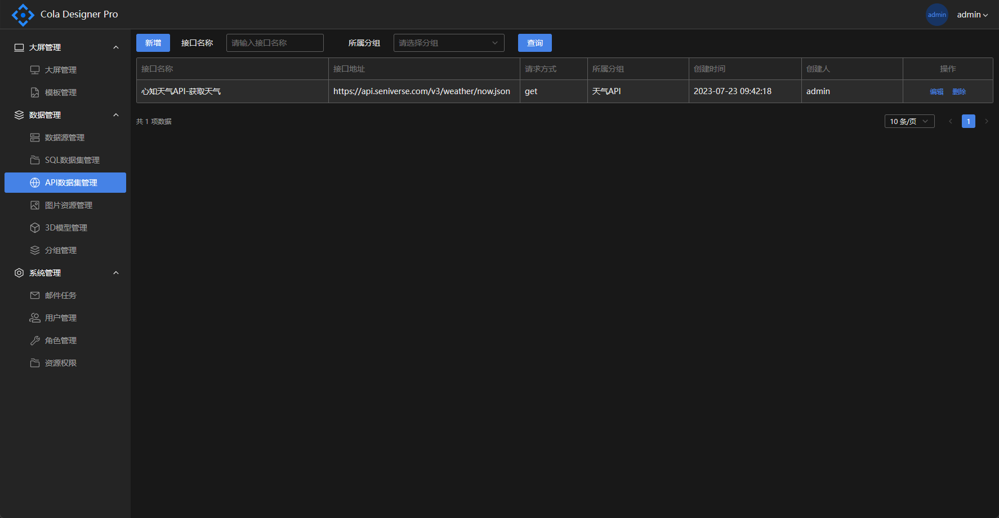
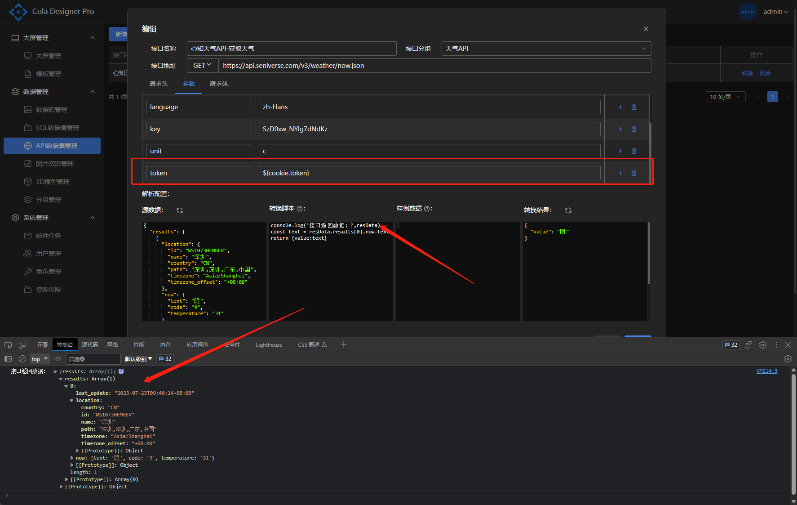
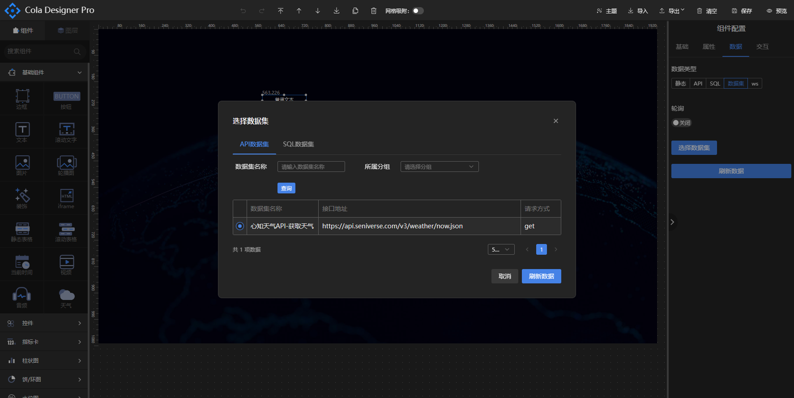

# 数据源

拖动支持数据配置的组件（如文本、柱状图...组件）至设计器设计区域，在右侧配置栏选中数据一栏进行组件的数据配置，当前版本支持的数据源可选为静态数据、API、SQL、数据集选项。组件默认选中的数据源为静态数据源，格式为JSON。可点击编辑数据按钮查看组件的数据源格式或编辑组件的数据。



如图所示，文本组件的默认数据源为{“value”:”普通文本”}，value值对应组件显示的文本数据。除静态数据源的其他数据源都支持定时刷新配置，单位为秒，使用定时刷新需要开启轮询按钮并配置轮询的间隔时间。

## 静态数据源

静态数据源为组件的默认数据源，内容为JSON格式，新添加的自定义组件默认的数据格式也必须设置为json格式。点击“编辑数据”按钮会弹出数据内容框，此时可更改数值再点击刷新数据按钮对组件数据进行刷新。

## API数据源

选中可配置数据的组件，右侧数据配置栏选择API选项，下方可配置API的地址，此处要求保证API返回的数据与组件静态数据格式相同，且API可直接访问获取数据，<span style="color:red">注意：不要在此处直接填写http链接。</span>请使用nginx进行接口代理，示例：

例如完整接口地址为：http://127.0.0.1:8080/sysApi/restApi/text

1. 配置nginx代理：

```editorconfig
server {
    listen       80;
    server_name  pro.icelery.fun;
    location ^~ /designApi/ {
        proxy_pass http://127.0.0.1:6882/;
    }
    location ^~ /file/ {
        alias /opt/upload/file/;
    }
                         
    #新增接口代理
    location ^~ /sysApi/ {
        proxy_pass http://127.0.0.1:8080/;
    }                     
                         
    location / {
        root   /opt/project/dist/;
        index  index.html;
        try_files  $uri $uri/ /index.html;
    }
}
```
2. 填写组件API数据源地址：/sysApi/restApi/text
3. 点击刷新数据按钮



## SQL数据源

组件数据类型可选择SQL类型，使用人员可选择在数据源管理配置的数据库，通过编写sql脚本直接从数据库中获取数据展示到对应的组件上，同样的sql的返回结果需要跟组件的静态数据格式保持一致。



## 数据集
### API数据集
在实际数据对接中，大部分第三方成熟系统开放的API返回数据都无法满足组件需要的数据格式，对于这种情况，cola-design-pro提供了API数据集处理方案，可对API的请求头、请求方式、请求体进行配置，API返回的结果也可以通过编写js转换脚本将返回值转换成组件对应的格式，应对API的多肽形式。

进入系统管理界面，展开数据管理菜单，点击API数据集管理，列表页面展示当前系统已经接入的API，可对其进行编辑和删除操作。



* 新增：

点击表格左上角新增按钮，弹出新增API数据集表单，接口名称为必填项，用于区分接口的使用场景，接口地址为不带任何参数的全路径，如：https://域名/systrm/api/text，请求头和请求参数在下方的tab栏中配置，默认会添加一个content-type:application/json的请求头，可点击右边的添加按钮和删除按钮进行对应操作。

对于需要使用cookie中的数据进行token验证类型的接口，我们提供了cookie表达式的解决方案，使用方式为${cookie.key}，请求时表达式会自动转换成从cookie中解析的具体参数值。



* 解析配置

解析配置栏中源数据为接口返回的原始数据，点击刷新按钮会对接口发起请求并将API返回的结果放置在源数据的代码框内，此处只做测试接口展示。

转换脚本代码编辑框可为接口源数据转换成组件需要的数据格式提供Javascript脚本驱动，编写脚本时，接口的返回数据被封装在resData参数中，脚本可直接使用，类型为JSON。

样例数据栏可展示执行转换脚本后的最终需要转换成的数据格式，主要作用是为了给编写转换脚本的人员提供参考。使用者可在设计器页面复制想要展示的组件的静态数据到此处，方便写脚本的时候参考。

当请求参数信息和转换脚本都编写好后，可在结果数据栏点击刷新按钮，系统会对配置的接口发起请求并且执行JS转换脚本，将最终转换的数据显示在结果数据的代码框中。

* 使用

保存好API数据集后，会在数据集列表展示，在设计器使用时，右侧数据属性栏需要选择数据集的数据源，点击选择数据集按钮会弹出之前保存的数据集列表，在此处选择对应需要展示的数据集即可。



### SQL数据集

与API数据集类似，在SQL查询结果无法满足组件需要的数据格式时可采用SQL数据集的模式，可通过编写JavaScript脚本对查询结果进行转换。

## websocket数据源
对于部分要求实时性较高监控大屏，我们提供了websocket数据源接入方式，每个大屏支持接入一条websocket链接，具体使用步骤如下：
1. 大屏设置填写WebSocket全链接。
2. 组件接入socket数据源：在数据一栏选择ws，填写socket数据Key(JSON key表达式)。
3. 保存刷新页面，推送JSONObject数据测试。
* 示例：
```json
// 推送数据
{
  "socketData": {
    "cptText1": {
      "value": "我是测试websocket数据"
    }
  }
}

// 文本组件填写socket数据Key为：
socketData.cptText1
```


注意：<span style="color:red">不同组件不要使用相同的key！！！，</span>否则会导致接收到数据时，组件收到不能满足当前数据格式的key值的数据而渲染失败。

## 动态数据源获取URL中的参数

在实际应用场景中，数据源需要加入一些动态条件完成查询，比如查询不同季度或不同部门的报表，此时数据源只需要加入一个简单的查询参数，再通过设置新的数据源已不可取，可通过在预览时的URL中将需要的参数带上，数据源再通过表达式获取，取值方式为${url.参数名}。

如编写SQL数据源：
```sql
select * from tb_test where month = '${url.month}'
```

API数据源：
```text
/api/sys/getPieData?Month=${url.month}
```
例如访问报表时，在URL中加入month=202212访问，已上数据源写法最终会将${url.month}替换为URL中的month参数值202212，如果url中未传数据源中使用的参数，则替换为空，需自行处理为空时的查询逻辑。

注：ws暂不支持从url动态取参。