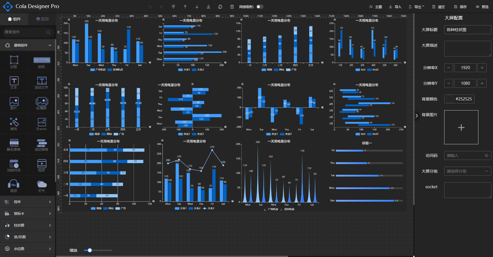

# 设计器

## 设计大屏

新建大屏或模板后，鼠标放置在列表页面的大屏上会弹出相应的操作按钮组，点击设计按钮将跳转到大屏或模板的设计器页面。

设计器头部为操作栏，中间操作栏为组件快捷操作，可进行回退/前进和层级数快速设置，开启网格对齐按钮后拖拽组件时可自动根据网格位置吸附，右侧操作部分可进行主题更改、导入、导出、清空、预览和保存操作。设计器左侧为组件栏，展示设计器所有的组件和已选图层列表，组件按照类型进行分组，可在上方的搜索框输入组件名进行模糊搜索，组件栏选中图层tab时，列表显示大屏上已经拖动的所有组件列表。在图层列表可点击某项图层，点击后大屏组件会进行高亮显示，图层列表的组件俺新增大顺序进行排序，新拖动的组件在图层列表的最上层，最上层的组件相应在设计区域也在最上层，当两个组件在垂直方向重叠时，可变更两者的图层排序位置确认其在垂直方向是的层级显示。

设计器中间部分为设计区域，使用组件时将鼠标按住需要使用到组件拖动到设计区域，拖动至设计区域的组件可随意拖放位置和拉伸，滑动设计区域左下角的滑块可以对设计区域进行缩放。

鼠标右键选中组件可弹出组件的操作菜单，可对组件进行删除、复制、上移、下移、置顶和置底操作。

设计器右侧为属性配置栏，可展开和收起，鼠标点击设计区域空白处时配置栏显示大屏的基础信息，鼠标点击设计区域的组件时显示当前组件的配置信息。

组件的配置栏包含基础、属性、数据、交互四个tab，基础栏配置组件的名称、显隐、坐标、宽高以及旋转角度数据，所有的组件都可设置这些基础信息。属性tab展示组件特有的可配置信息，每个组件的配置都有所不同，如文本组件可配置文字颜色、大小等信息，柱状图组件可配置排列方向、轴线显示的等信息。右侧配置数据与设计区域的组件显示实时关联。

配置栏数据tab显示组件数据源的配置，值得注意的是不是所有的组件都含有这个tab，如边框、图片等静态组件。组件数据源当前可选为静态数据、API、SQL、数据集，默认数据为静态数据，可点击编辑数据进行数据修改。选择动态数据时可进行轮询时间配置，设置后组件将定时轮询获取最新的数据展示。具体数据源使用方式请参考本文档第五章节。

配置栏交互tab可设置组件点击时的交互事件，当前版本可选择交互类型有显示/隐藏组件、更新API参数、下钻和跳转外部链接，具体交互使用方式可参考[组件交互。](#组件交互)

## 主题设置

设计好的大屏可根据具体场景一键切换主题，以满足设计配色的统一性，可一键设置画布上的组件的字体颜色以及主题颜色，点击配色可进行实时预览，点击取消进行还原，点击确定则设置主题生效。

## 保存&预览
## 导入导出
## 组件交互
