# 设计器

## 设计大屏

新建大屏或模板后，鼠标放置在列表页面的大屏上会弹出相应的操作按钮组，点击设计按钮将跳转到大屏或模板的设计器页面。

设计器头部为操作栏，中间操作栏为组件快捷操作，可进行回退/前进和层级数快速设置，开启网格对齐按钮后拖拽组件时可自动根据网格位置吸附，右侧操作部分可进行主题更改、导入、导出、清空、预览和保存操作。设计器左侧为组件栏，展示设计器所有的组件和已选图层列表，组件按照类型进行分组，可在上方的搜索框输入组件名进行模糊搜索，组件栏选中图层tab时，列表显示大屏上已经拖动的所有组件列表。在图层列表可点击某项图层，点击后大屏组件会进行高亮显示，图层列表的组件俺新增大顺序进行排序，新拖动的组件在图层列表的最上层，最上层的组件相应在设计区域也在最上层，当两个组件在垂直方向重叠时，可变更两者的图层排序位置确认其在垂直方向是的层级显示。

设计器中间部分为设计区域，使用组件时将鼠标按住需要使用到组件拖动到设计区域，拖动至设计区域的组件可随意拖放位置和拉伸，滑动设计区域左下角的滑块可以对设计区域进行缩放。

鼠标右键选中组件可弹出组件的操作菜单，可对组件进行删除、复制、上移、下移、置顶和置底操作。

设计器右侧为属性配置栏，可展开和收起，鼠标点击设计区域空白处时配置栏显示大屏的基础信息，鼠标点击设计区域的组件时显示当前组件的配置信息。

组件的配置栏包含基础、属性、数据、交互四个tab，基础栏配置组件的名称、显隐、坐标、宽高以及旋转角度数据，所有的组件都可设置这些基础信息。属性tab展示组件特有的可配置信息，每个组件的配置都有所不同，如文本组件可配置文字颜色、大小等信息，柱状图组件可配置排列方向、轴线显示的等信息。右侧配置数据与设计区域的组件显示实时关联。

配置栏数据tab显示组件数据源的配置，值得注意的是不是所有的组件都含有这个tab，如边框、图片等静态组件。组件数据源当前可选为静态数据、API、SQL、数据集，默认数据为静态数据，可点击编辑数据进行数据修改。选择动态数据时可进行轮询时间配置，设置后组件将定时轮询获取最新的数据展示。具体数据源使用方式请参考本文档第五章节。

配置栏交互tab可设置组件点击时的交互事件，当前版本可选择交互类型有显示/隐藏组件、更新API参数、下钻和跳转外部链接，具体交互使用方式可参考[组件交互。](#组件交互)

## 主题设置

设计好的大屏可根据具体场景一键切换主题，以满足设计配色的统一性，可一键设置画布上的组件的字体颜色以及主题颜色，点击配色可进行实时预览，点击取消进行还原，点击确定则设置主题生效。

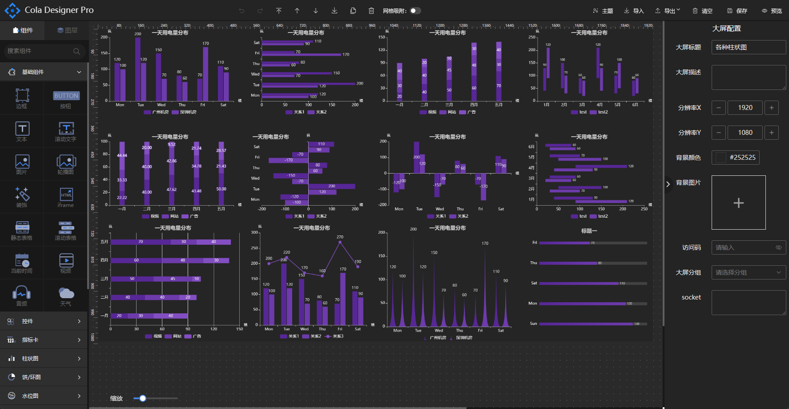

## 保存&预览

大屏设计好后可先点击预览按钮查看设计，预览时会根据大屏设置的分辨率进行按比例缩放，确认无误后可点击保存按钮将设计数据保存到数据库，保存成功会生成访问链接，可在大屏列表点击分享按钮复制链接进行访问最终的设计大屏。

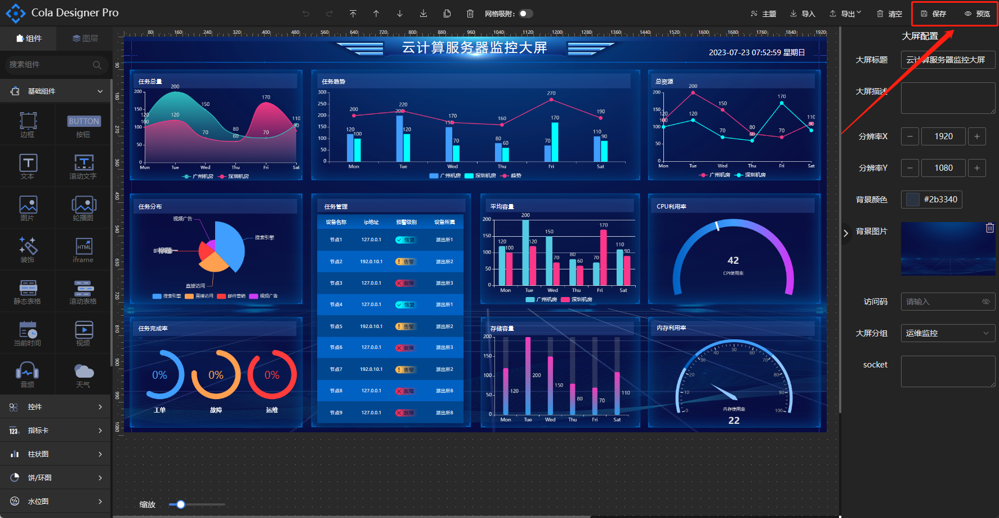

## 复制&粘贴组件

在设计器页面选中组件，点击鼠标右键会出现操作栏，点击操作栏中复制按钮会将当前组件及其配置克隆到画布上，复制后点击设计器顶部操作栏的粘贴按钮可继续克隆复制的组件。

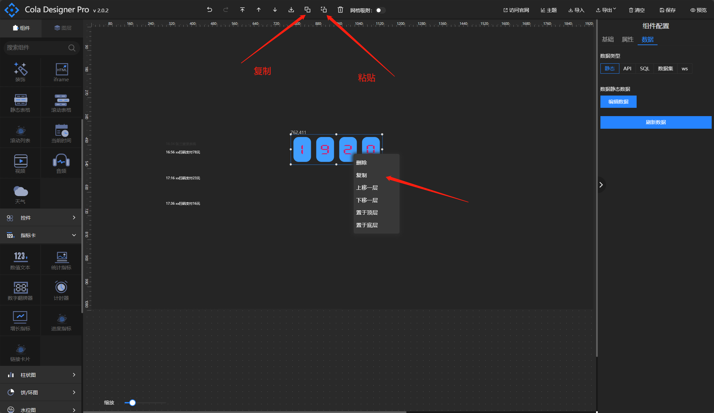

也可在官方组件库模板页面复制想要的组件，组件库模板页面复制的组件粘贴后默认位置为(20,20)

在线组件库：[在线组件库](http://pro.icelery.fun/template?tab=component)

注意事项：粘贴需要浏览器授权读取剪贴板的权限。剪贴板被其他内容覆盖后无法成功克隆组件。

## 导入导出

在设计器头部设置栏有导出按钮，目前提供了导出为图片和设计文件两种导出方式，导出的设计文件后缀为cd的json格式文件，保存大屏组件的坐标以及配置信息。导出图片格式为png。点击导出选择导出方式，在弹出的对话框中设置保存的位置即可完成导出。

导入大屏目前暂只支持设计文件的导入，需要与导出的版本号统一才可完成导入功能，点击导入，在弹出的对话框中选择当前软件版本相同的设计cd文件，点击确定完成导入。导入大屏会将当前页面已经选择的组件进行覆盖。

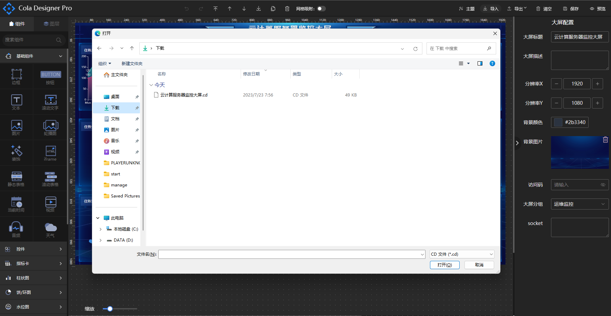

## 组件交互

设计器右侧配置栏可设置指定组件的交互逻辑，当前版本支持显示/隐藏组件、更新组件API参数、下钻和跳转外部链接四种方式的交互，交互事件为点击时（选项卡组件的交互类型为切换选项时）。并不是所有组件都支持交互，具体事件绑定在哪一个元素上由组件内部逻辑指定，如文本组件事件在点击文本框时触发，柱状图组件在点击柱子时触发...。交互事件默认不勾选，需要设置交互时需要在配置栏交互TAB页勾选”触发条件”选项。

### 显示/隐藏组件

交互类型选择“显示/隐藏组件”时，需要在下方选择显示或隐藏的对象，”显示”TAB页勾选点击当前组件时需要显示的其他组件（组件默认为显示，可在基础栏设置组件的初始状态），”隐藏”TAB页勾选点击当前组件时需要隐藏的组件。注意：”显示”栏勾选的组件在”隐藏”栏为不可勾选状态。注：报表暂不支持组件显隐交互。

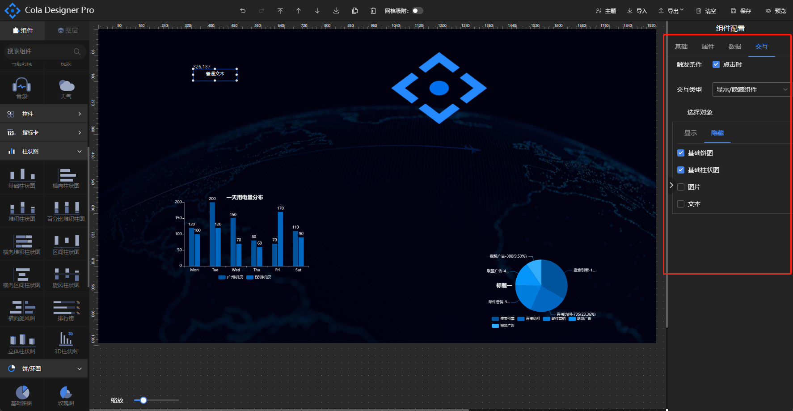

* 示例：点击按钮控制指定组件显示和隐藏

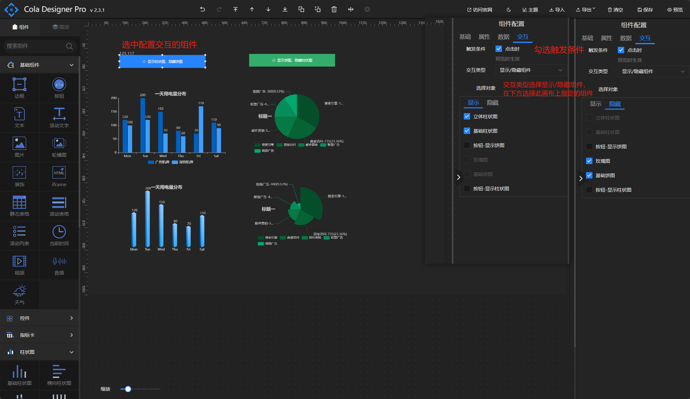
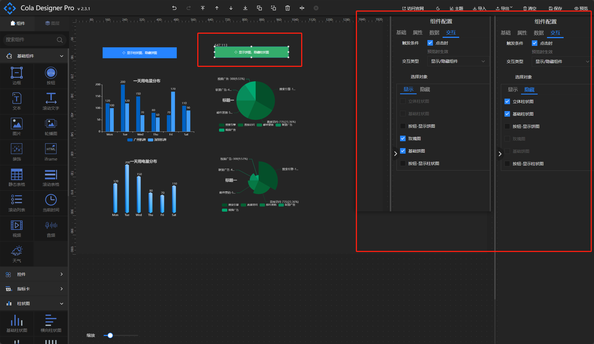
预览时点击对应的按钮可切换显示不同的组件

* 示例：点击单个按钮切换指定组件显示和隐藏

     单个组件无法同时配置多个事件，可以在同一位置放置两个组件配置各自的交互事件实现。

  1. 拖动按钮组件到画布并修改组件名称为“按钮-点我显示”
  2. 复制上面的组件并设置名称为“按钮-点我隐藏”
  3. 拖动一个饼图组件到画布
  4. 给“按钮-点我显示”组件配置交互事件
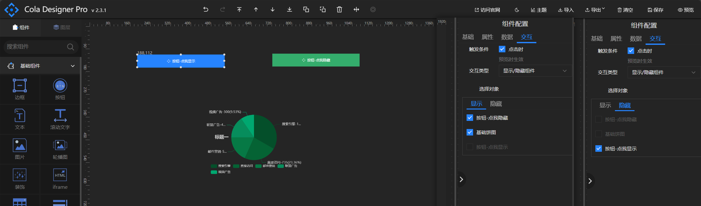
  5. 给“按钮-点我隐藏”组件配置交互事件并预览查看效果
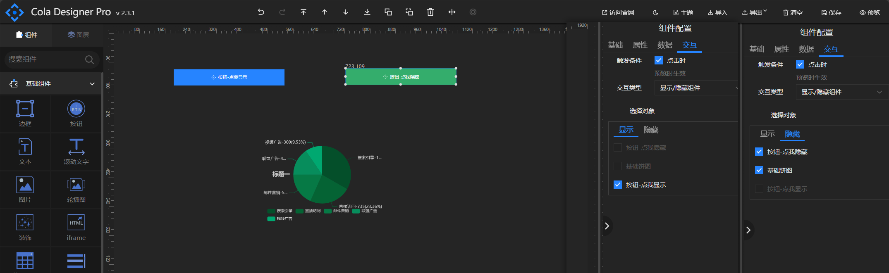
  6. 设置“按钮-点我隐藏”和”饼图“组件默认不显示，将“按钮-点我隐藏”组件设置坐标X轴/Y轴与组件“按钮-点我显示”保持一致，然后可以预览实现点击按钮切换组件显示隐藏的交互

* 示例：下拉框控制显示不同的组件

     下拉框/选项卡组件支持对下拉选项配置单独的交互对象，可在交互栏选择触发选项设置。

  1. 拖动下拉框组件到画布
  2. 给下拉框的选项一配置交互事件
     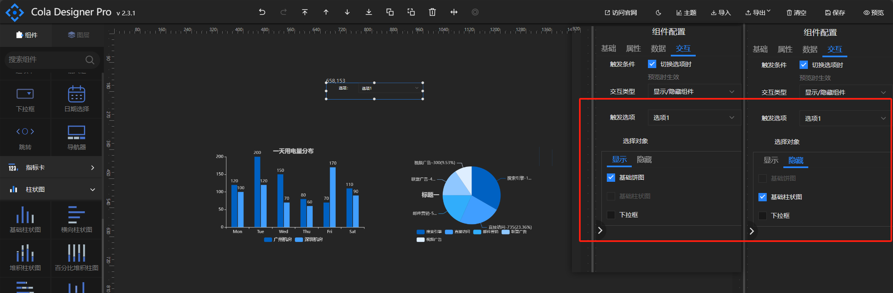
  3. 给下拉框的选项二配置交互事件
     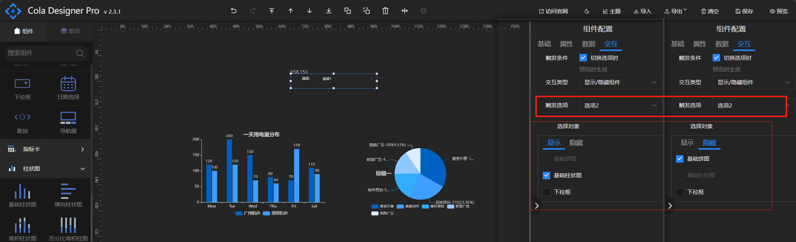

### 更新API参数

更新API参数交互类型可实现组件数据联动效果，可对指定组件的API数据源进行修改URL参数并执行刷新，参数名对应URL的参数的name，参数值对应URL参数的value，参数值可选为固定值和自动获取，选择固定值时需要手动填写参数值的内容，选择自动获取时可获取组件设定的点击时的文本值，具体内容由组件设定，如文本组件获取的内容为文本内容，柱状图组件获取点击柱子的label，边框组件则为空值...。
若需要更新中指定参数对象的key(如请求体中存在参数user.username)，请使用$关键字(如$.user.username)

* 示例：下拉框选择不同选项更新表格展示的数据(API数据源)
  1. 拖动静态表格组件到画布并设置数据源为api，此api可接收参数type根据不同指返回不同的表格数据
  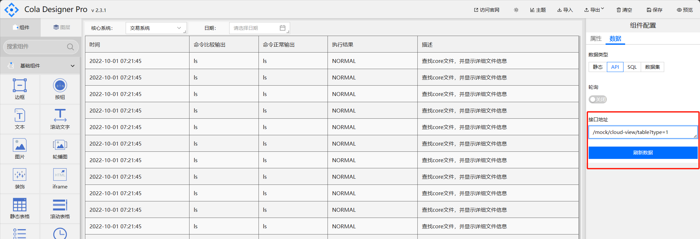
  2. 拖动下拉框组件分别给选项并设置更新api参数交互
  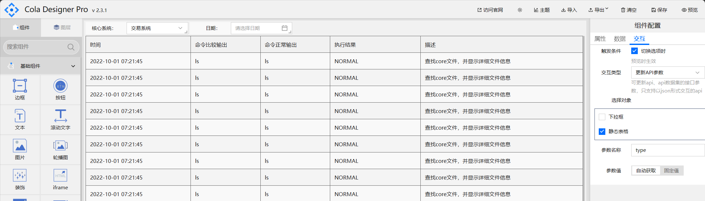
  3. 预览查看效果，切换下拉框后会将下拉选项参数传递到表格接口中并触发接口更新

* 示例：查看不同城市天气(API数据集)
  1. 拖动文本组件并配置数据源为api数据集，此api数据集可接收城市参数并返回城市的天气信息
     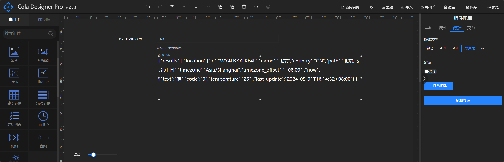
  2. 拖动输入框组件并配置交互事件为更新文本组件的api，填写参数名称为接口的城市参数名称
     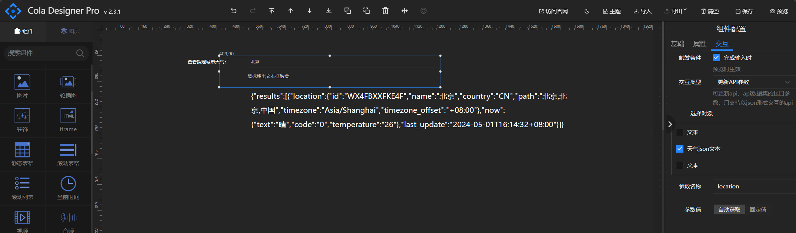
  3. 点击预览在输入框中输入不同的城市名称查看文本空显示的天气内容

注意：更新API参数的交互只适用于使用json参数交互的接口。

### 下钻

选择下钻交互类型时，需要设置下钻的大屏，下方选择大屏列表只展示当前登录用户拥有权限的大屏，设置好后点击组件即可下钻到设定的大屏。

### 跳转外部链接

选择跳转外部链接时，需要设置指定的跳转网页的全链接如：”https://www.baidu.com/”, 设置好后点击组件即可在新标签页打开设定的网页链接。
