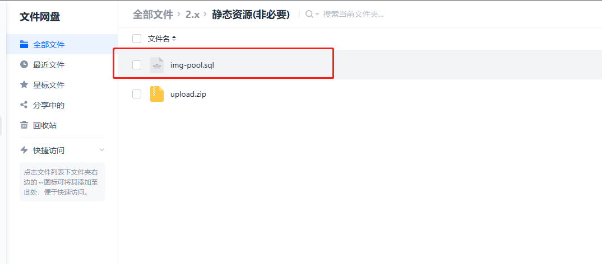
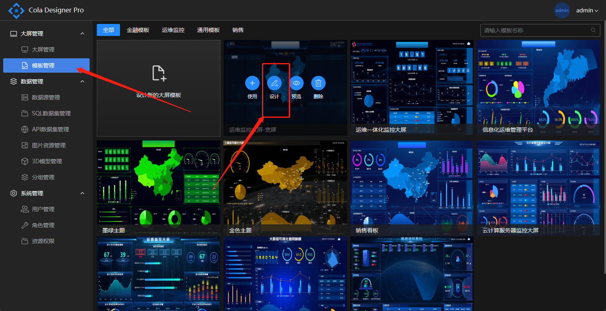
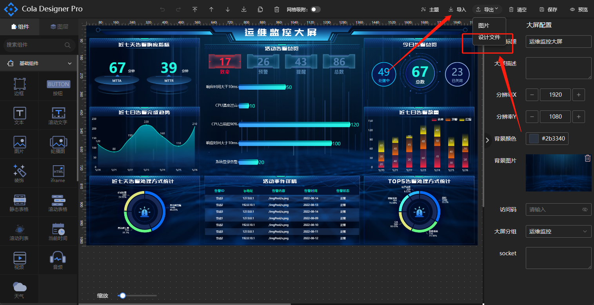

# 静态资源&模板

自2.0版本开始，交付数据库中不再内置静态资源和模板，以可选包的形式提供，购买者可自行选择下载资源包进行导入。

## 导入静态资源

图片静态资源提供sql增量包和源文件，在导入完数据库后执行

upload.zip为静态资源包，需上传至服务器与后台yml上传路径和nginx配置静态资源路径一致。

## 导入模板

模板库将不定期更新，可在官网体验环境自行选择需要的模板导出cd文件然后再自己的环境中新建导入。

体验环境地址：

[http://pro.icelery.fun/login](http://pro.icelery.fun/login)

用户名：demo

密码：123456

