# 管理后台
## 登录
浏览器访问配置的域名和端口，进入登录界面，输入用户名和密码即可进入系统。进入系统后首页为大屏列表页，展示当前系统已经创建并且当前用户具有查看权限的大屏列表。

## 大屏管理
大屏列表页面展示当前已经创建的所有大屏，可通过分组和右上角搜索框进行大屏筛选。
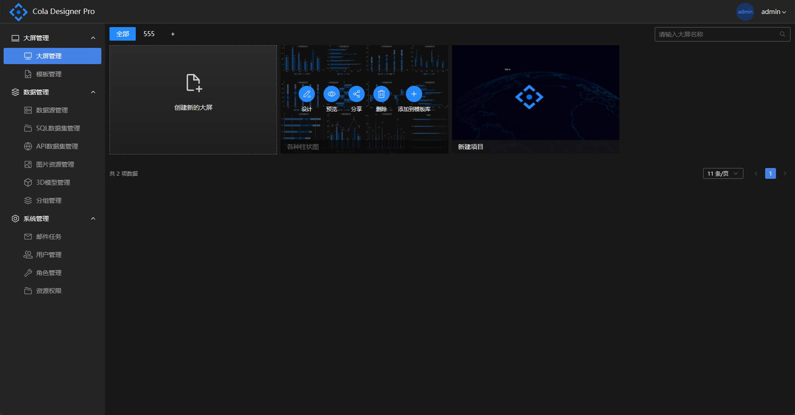
用户可点击左上角“创建新的大屏按钮”进行新建，新建时可选择从模板库直接创建，也可以选择创建空的大屏，创建完成后会直接跳转到设计页面，进入设计页面后，展开右侧属性配置栏可对大屏的基本信息进行设置。新建空白大屏时，默认大屏名称为“新建大屏”，默认分辨率为1920*1080。大屏访问码为可选项，若大屏设置了访问码，则在正式访问时需要输入设置的访问码进行校验。

将鼠标放置在大屏列表页面单个大屏上，会弹出所选大屏的操作项，点击设计按钮可对保存的大屏进行基础信息修改和大屏设计。点击预览按钮会进入正式预览页面，如果大屏设置了访问码，则预览时需要先输入正确的访问码。点击分享按钮会弹出大屏的预览链接。点击删除按钮可对大屏进行删除。点击添加到模板库会将选择的大屏复制到模板库，在新建大屏时又可以选择模板来直接创建。
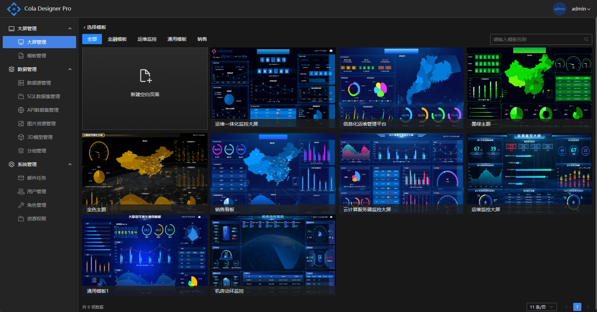

列表页顶部可通过分组快速筛选大屏，点击“+”号按钮可对分组进行新增，鼠标放置高亮分组上会出现删除按钮，点击删除可将分组信息删除，删除分组不会删除分组下的大屏，删除的分组下的大屏可在“全部”分类中查看
## 模板管理
模板管理功能和大屏列表功能类似，用户可设计一些比较常用的大屏作为模板，创建新的大屏时可在模板库直接选择模板进行创建，也可在模板列表页面点击使用进行大屏的创建。
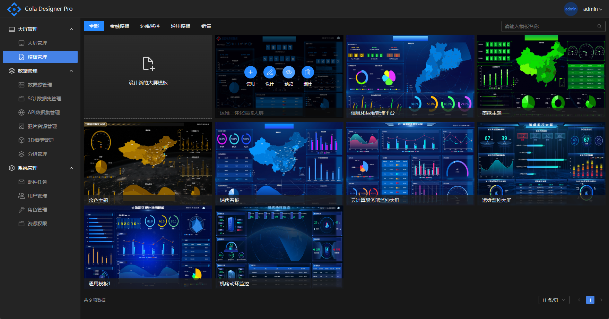
点击“设计新的大屏模板”按钮弹出新建模板表单，用户需要输入模板的名称、描述、分辨率、分组等基本信息，点击确认按钮完成模板创建，创建好模板后会在模板列表页面显示，点击设计按钮可对选择的模板进行设计和基础信息的修改。

## 分享大屏

保存完大屏后可在大屏列表获取指定的大屏的访问链接，使用者可设置大屏是否运行公开访问，未开启公开访问进行访问时访问者需要使用账号登录系统，若账号没有访问权限则会给出相应提示。开启公开访问则无需登录账号，使用者可在浏览器直接输入访问链接进行访问，公开访问默认不开启，需要设计者手动打开。此场景也适用其他平台接入使用跳转或者iframe的方式打开大屏链接。
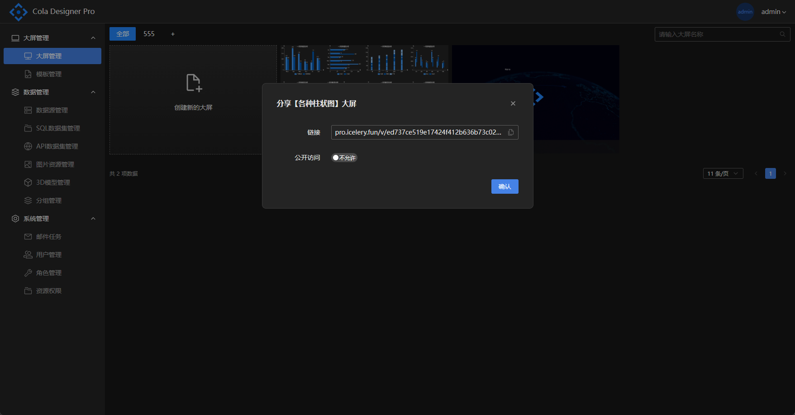

## 图片资源库管理

图片库功能作为大屏设计辅助功能，主要实现对需要插入图片的组件如图片、轮播图等组件提供资源支持，所有静态资源统一管理，可实现资源的重复利用，减少磁盘空间占用和网络消耗。用户拖动一个图片组件，在属性栏中选择图片，弹出图片资源库选择框，图片库展示由用户上传的所有图片资源，并提供下载上传功能，使用者可选择分组进行筛选，选择图片后回显到图片组件中。
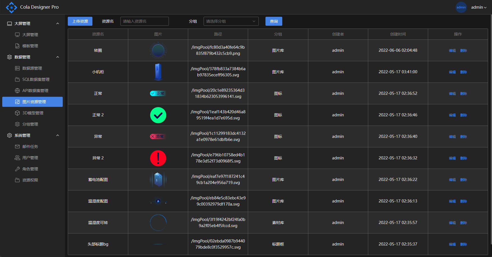
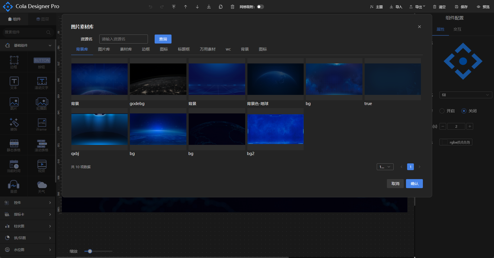

## 3D模型管理

3D模型库功能与图片资源库功能类似，供模型组件使用，主要实现对3D模型文件的统一管理，可实现资源的重复利用，减少磁盘空间消耗。
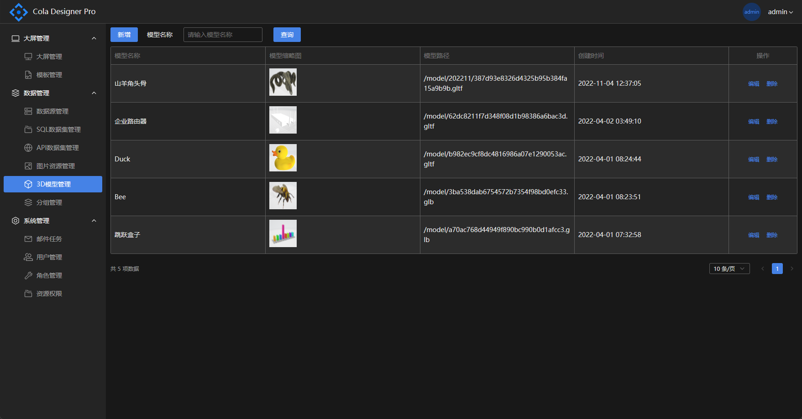
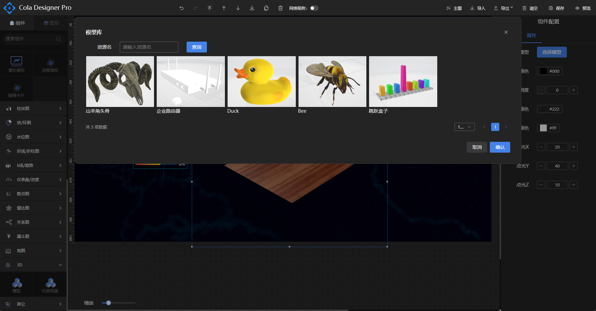

## 邮件任务

邮件任务功能可设置定期向指定用户发送指定报表的截图邮件，新增任务时需要选择发送的报表、用户以及发送邮件的时间，状态选择激活时生效。列表页可选择对邮件任务进行激活或停止操作，也可点击立即执行实时发送邮件。
(此功能正在重构...)

## 用户管理

用户管理列表展示当前系统所有的用户，可对单个用户进行基本信息修改和密码重置，重置后默认密码为“123456”，点击新增按钮弹出新增用户表单可为系统添加新用户。
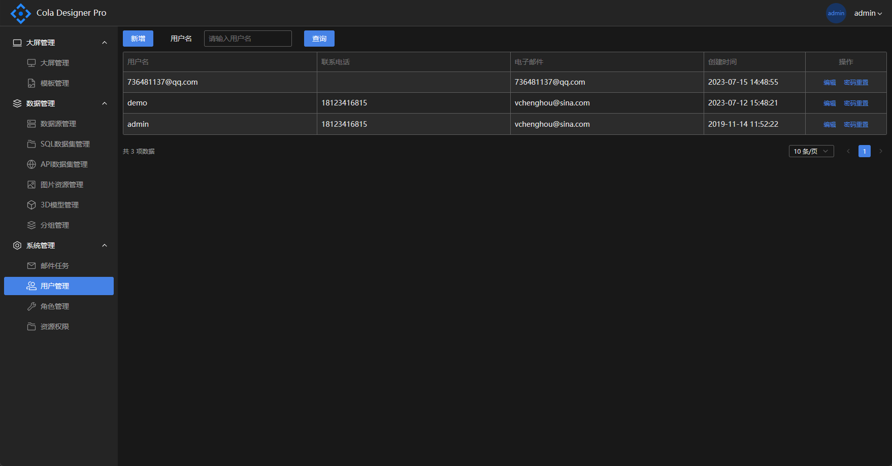

## 角色管理

角色管理列表展示当前系统所有的角色，角色与用户的关系为一对一，角色列表页面可对单个角色进行菜单权限控制，管理员默认拥有对系统所有的功能权限。
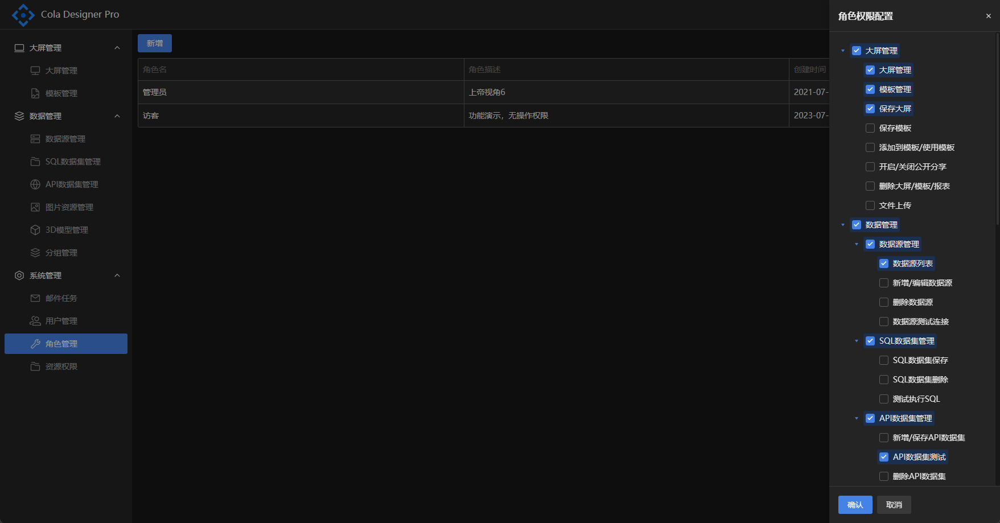

## 资源权限

资源权限菜单可管理系统内大屏、模板、数据源、API数据集和SQL数据集的查看、编辑和删除权限，可精确控制某个用户对某调数据的相应权限。
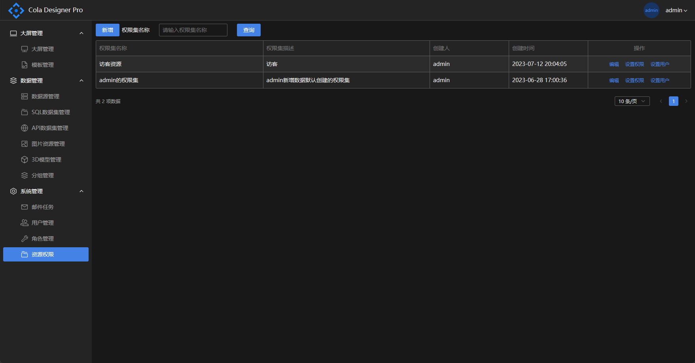
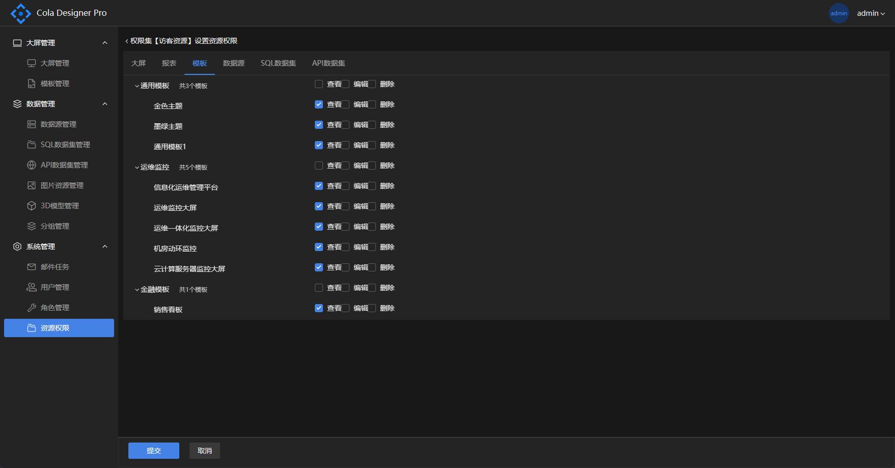