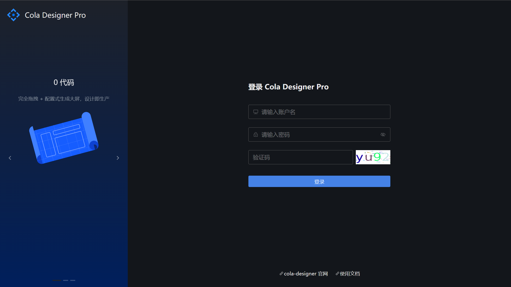

# 管理后台
## 登录
浏览器访问配置的域名和端口，进入登录界面，输入用户名和密码即可进入系统。进入系统后首页为大屏列表页，展示当前系统已经创建并且当前用户具有查看权限的大屏列表。

## 大屏管理
大屏列表页面展示当前已经创建的所有大屏，可通过分组和右上角搜索框进行大屏筛选。

用户可点击左上角“创建新的大屏按钮”进行新建，新建时可选择从模板库直接创建，也可以选择创建空的大屏，创建完成后会直接跳转到设计页面，进入设计页面后，展开右侧属性配置栏可对大屏的基本信息进行设置。新建空白大屏时，默认大屏名称为“新建大屏”，默认分辨率为1920*1080。大屏访问码为可选项，若大屏设置了访问码，则在正式访问时需要输入设置的访问码进行校验。

将鼠标放置在大屏列表页面单个大屏上，会弹出所选大屏的操作项，点击设计按钮可对保存的大屏进行基础信息修改和大屏设计。点击预览按钮会进入正式预览页面，如果大屏设置了访问码，则预览时需要先输入正确的访问码。点击分享按钮会弹出大屏的预览链接。点击删除按钮可对大屏进行删除。点击添加到模板库会将选择的大屏复制到模板库，在新建大屏时又可以选择模板来直接创建。
## 模板管理
模板管理功能和大屏列表功能类似，用户可设计一些比较常用的大屏作为模板，创建新的大屏时可在模板库直接选择模板进行创建，也可在模板列表页面点击使用进行大屏的创建。

点击“设计新的大屏模板”按钮弹出新建模板表单，用户需要输入模板的名称、描述、分辨率、分组等基本信息，点击确认按钮完成模板创建，创建好模板后会在模板列表页面显示，点击设计按钮可对选择的模板进行设计和基础信息的修改。

## 分享大屏

## 图片资源库管理
## 3D模型管理
## 邮件任务
## 用户管理
## 角色管理
## 资源权限
